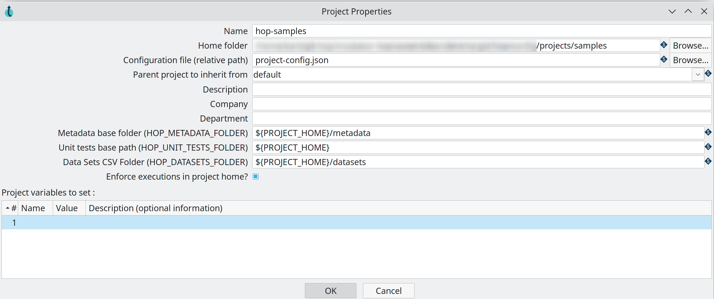
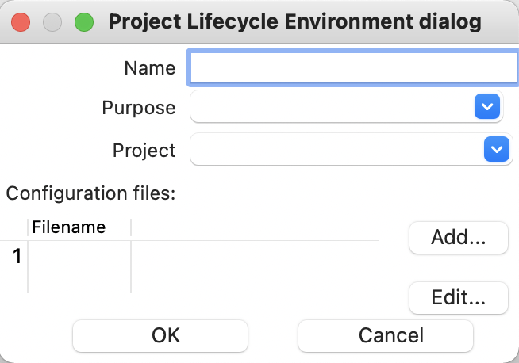
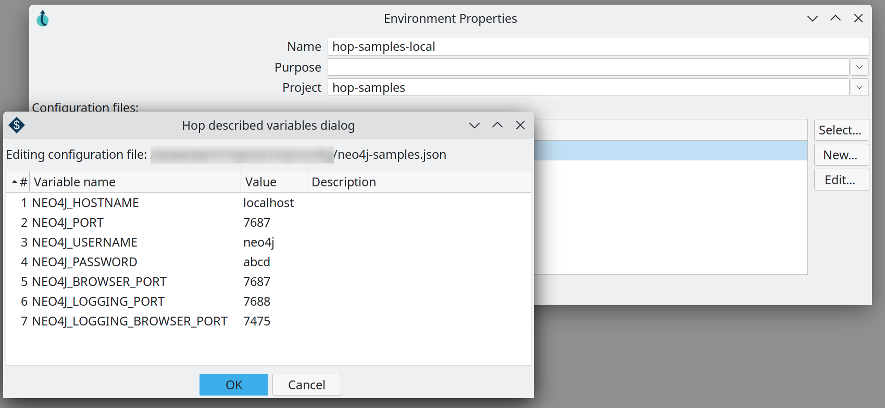
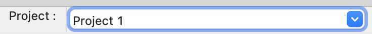
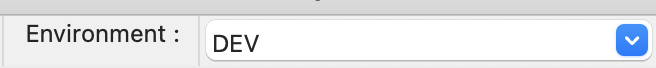

# 项目与环境

## 创建项目

要创建新项目，请点击 *Add a new project* 按钮。

此按钮将打开以下对话框：

.项目属性

| 属性 | 描述 | 支持变量 | 必填 | 默认值 |
|---|---|---|---|---|
| 名称 | 项目名称 | 是 | 否 |  |
| 主文件夹 | 项目所在的文件夹 | 是 | 否 |  |
| 配置文件（相对路径） | 项目配置 json 所在的文件夹 | 是 | 是 |  |
| 继承的父项目 | 要继承 metadata（如连接）的父项目 | 是 | 否 | default |
| 描述 | 此环境的描述 | 否 | 否 |  |
| 公司 | 此环境所属的公司 | 否 | 否 |  |
| 部门 | 创建此环境的部门 | 否 | 否 |  |
| Metadata 基础文件夹 | 存储此环境 metadata 的文件夹 | 是 | 是 | {openvar}PROJECT_HOME{closevar}/metadata |
| 单元测试基础路径 | 项目中单元测试使用的基础路径。如果你的 `Unit test base path` 定义为 `{openvar}PROJECT_HOME{closevar}/my_pipelines`，单元测试将把此文件夹中的 pipeline 引用为 `./my_pipeline.hpl`。 | 是 | 是 | {openvar}PROJECT_HOME{closevar} |
| 数据集 CSV 文件夹 | 存储此环境数据文件的文件夹 | 是 | 是 | {openvar}PROJECT_HOME{closevar}/datasets |
| 强制在项目主目录中执行 | 当尝试执行不在环境主目录或其子目录中的 pipeline 或 workflow 时给出错误 | 是 | 是 | checked |
| 要设置的项目变量 | 用于此项目的变量名、值和变量描述列表 | 否 | 是 |  |

创建项目后，用户界面将切换到该项目，并询问你是否要创建环境。

## 创建环境

要创建新环境，请点击 *Add a new environment* 按钮。

此按钮将打开以下对话框：

.环境属性

| 属性 | 描述 | 支持变量 | 必填 | 默认值 |
|---|---|---|---|---|
| 名称 | 环境名称 | 否 | 否 | 最后创建的项目 |
| 用途 a | 此环境的用途。用途是环境类型的指示。除了预定义的用途外，你还可以添加自己的用途： |  |  |  |
| 项目 | 此环境所属的项目 | 否 | 否 | 最后创建的项目 |
| 配置文件 | 用作此环境配置的文件 | 否 | 否 |  |

每个环境将包含一个或多个环境文件，你可以在其中管理特定于环境的变量。

编辑按钮将打开环境文件，让你添加变量键值对。

创建环境后，用户界面将切换到该环境。

## 在项目和环境之间切换

要切换项目，可以从 Hop GUI 主工具栏使用项目列表。

切换到项目后，环境列表将更新为属于该项目的环境。
所有打开的文件都将被恢复，包括它们的缩放级别和其他 UI 设置。

## 编辑和删除项目

要编辑现有项目，请点击 *Edit the selected project* 按钮。

点击此按钮将重新打开项目对话框，你可以在其中进行修改，如 所述。

要删除项目，请点击 *Delete the selected project* 按钮。

## 编辑和删除环境

要编辑现有环境，请点击 *Edit the selected environment* 按钮。

点击此按钮将重新打开项目对话框，你可以在其中进行修改，如 所述。

要删除环境，请点击 *Delete the selected environment* 按钮。

