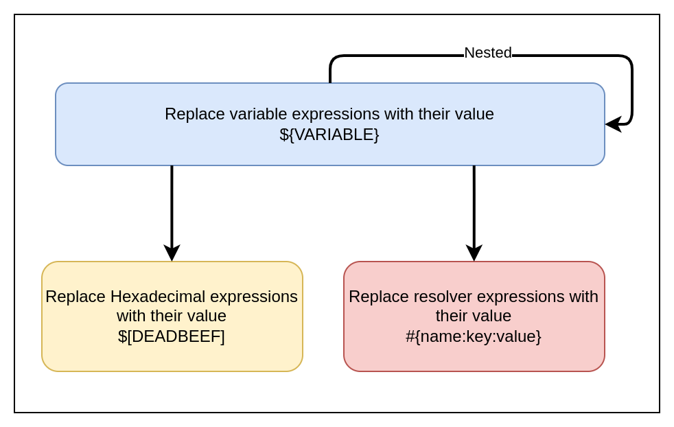
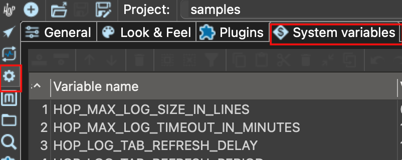

# 变量

## 什么是 Hop 变量？

你不会希望将解决方案硬编码。
硬编码主机名、用户名、密码、目录等是不好的做法。
变量使你的解决方案能够适应不断变化的环境。
例如，如果开发环境的数据库服务器与生产环境不同，你可以将其设置为变量。

> **💡 提示:** 字段、参数和变量在作用域内会隐式地向下游传递。你可以将它们传递任意多层，但"获取参数/变量"按钮只会从上一级获取。

## 字段

字段是数据行中的列，可以在某些 Transform 字段文本框和列中查看。在执行 workflow/pipeline 后，你可以查看作用域内的字段及其值（点击 Transform 右下角的小网格图标可以查看缓存结果的预览）。字段值可以向上游传递，例如当你使用 pipeline executor 并填充 Result rows 标签页，然后与子 pipeline 中的"copy rows to result" Transform 配合使用时。

## 参数

可以将参数理解为函数参数，它们会转换为同名变量。添加参数时，你实际上是在创建 MyPipeline(parameter1, parameter2,..)。参数（例如在 pipeline 或 workflow 属性中）需要在每个 pipeline 或 workflow 中至少声明一次。

例如，如果你在 pipeline executor 上设置了参数，被调用的 pipeline 必须在其 pipeline 属性中声明相同的参数名（如果想要继承值则设置为 NULL）。参数不能向上游"发送"，但你可以使用 Set variables Transform，它们会成为其定义作用域内的变量。

**显式 vs 隐式：** 如果你将参数设置为默认值，它就变成了显式的（例如在 pipeline 属性中编辑 pipeline 时），它将优先于同名的隐式变量（传入的变量），但不会优先于同名的显式参数。因此，每当你看到带有"Parameters/Variables"列标题的 Transform 时，这意味着一个显式参数被发送到函数中，该函数将设置一个变量名，覆盖之前同名的参数（如果想要在子级中覆盖显式设置的参数/变量，这很有用）。

要将隐式参数行为更改为显式，你也可以在 pipeline action 上禁用"pass all parameters"。参数只是在 workflow 或 pipeline 中显式定义的变量，使其从这些对象外部可识别。它们还可以有描述和默认值。

你不能将隐式变量继承与显式参数定义结合使用。因此，如果你在 pipeline 定义（或 pipeline executor）中添加了参数并希望设置它，你必须在子 pipeline action/Transform 的参数标签页中添加它，即使同名的变量已经存在。

**高级：** 在 Hop 中有多个层级可以设置变量，这些变量可能会或可能不会在下游被覆盖（Java -> Hop 环境 -> 项目 -> 运行配置 -> workflow -> pipeline）。

## 变量

变量更加全局化，作用域可以精确指定（整个 Java VM、祖父 workflow 等），而字段是在 Transform 之间流动的数据。局部变量可以在 pipeline 中设置，但不应在同一个 pipeline 中使用，因为它们不是线程安全的，可能会继承之前的值。更好的做法是在使用之前将变量发送或返回到另一个 pipeline/workflow。如果变量设置为更大的作用域，则可以向上游传递。例如：如果变量在父级中设置为"valid in the current workflow"。

可以将变量分为两种作用域来理解：运行时变量和环境/workflow 变量：

- 运行时变量 – 运行时变量依赖于 pipeline 信息来生成，因此不能预先设置，你需要以不同的方式声明它们才能使用。
- 环境/workflow 变量或参数 – 环境变量/参数设置一次，在任何下游 workflow/pipeline 中按需使用，无需使用 Get Variables，你可以直接引用它们，如 {openvar}myVariable{closevar}，除非你需要在字段/数据流中使用。
  - 例如：只需定义一次参数，甚至只需在 Pipeline Executor 中定义（无需在接收 pipeline 中定义）

Pipeline 需要启动才能获取新变量。正在运行或嵌套的 pipeline 无法获取新的变量值。当 pipeline 为 pipeline executor 中的每一行启动时，pipeline 被视为已启动。另一种选择是使用参数。

## 如何使用变量？

在 Hop 用户界面中，所有可以输入变量的地方在输入字段右侧都有一个 '$' 符号：


你可以通过在开头的 `{openvar}` 和结尾的 `{closevar}` 之间引用来指定变量。

${VARIABLE_NAME}

请注意，对于 textvar（支持变量的文本字段），你不必在这些地方指定变量。你可以输入硬编码的值（尽管我们建议尽可能使用变量）。

变量与其他自由格式文本的组合也是可能的，如下例所示：

${ENVIRONMENT_HOME}/input/source-file.txt

// CTRL-space snippet
> **💡 提示:** 你可以在输入字段中使用 CTRL-SPACE（OSX 上是 CMD-SPACE）查看已定义的变量列表。
此助手会将选定的变量插入到输入字段中。此处仅显示环境变量和 JVM 作用域的变量。在 pipeline 或 workflow 中通过父级、祖父级或根 workflow 创建的变量需要手动输入。
## 十六进制值

在极少数情况下，你可能需要在"二进制"文本文件中输入非字符值作为分隔符，例如使用零字节作为分隔符。
在这些场景中，你可以使用特殊的'变量'格式：

$[<hexadecimal value>]

几个示例：

| 值 | 含义 |
|---|---|
| `$[0D]` |  |
| 一个换行符 (CR) |  |
| `$[0A]` |  |
| 一个换行符 (LF) |  |
| `$[00]` |  |
| 一个十进制值为 0 的单字节 |  |
| `$[FFFF]` |  |
| 两个十进制值为 65535 的字节 |  |
| `$[CEA3]` |  |
| 表示 UTF-8 字符 Σ 的 2 个字节 |  |
| `$[e28ca8]` |  |
| 表示 UTF-8 字符 ⌨ 的 3 个字节 |  |
| `$[f09d849e]` |  |
| 表示 UTF-8 字符 𝄞 的 4 个字节 |  |

## 变量解析器

变量解析器是一个 [metadata 元素](../index.md)，允许我们通过解析器 plugin 查找值。
使用这些 metadata 元素解析变量的格式如下：

```
#{name:key:element}
```
有关其工作原理的更多信息，请访问[变量解析器页面](../index.md)。

## 解析概述

当我们解析变量表达式时，可能会出现以下状态：



## 如何定义变量？

变量可以在所有合理的地方定义和设置：

- 在 hop-config.json 中（当适用于整个安装时）
- 在环境配置文件中（当涉及特定生命周期环境时）
- 在[项目](projects-environments.md)中
- 在[pipeline 运行配置](../07-管道/pipeline-run-configurations.md)中
- 作为 pipeline 或 workflow 的默认参数值
- 使用 pipeline 中的 [Set Variables](../03-转换插件/其他转换/setvariable.md) Transform
- 使用 workflow 中的 [Set Variables](../04-动作插件/脚本与评估类/setvariables.md) Action
- 使用 [Hop run](../index.md) 执行时

## 局部性

变量在定义它们的位置是局部的。

这意味着在特定位置设置变量意味着它将从该位置开始被继承。

这也意味着了解变量可以在哪里设置和使用，以及其背后的层次结构非常重要。

## 层次结构

.变量层次结构

| 位置 | 继承 |
|---|---|
| 系统属性 | 被 JVM 和 Hop 中所有其他位置继承 |
| 环境 | 被运行配置继承 |
| 运行配置 | Pipeline 运行配置被环境继承 |
| Pipeline | 被 pipeline 运行配置继承 |
| Workflow | 被 workflow 运行配置继承 |
| Metadata 对象 | 被其加载位置继承 |

## 参数

Pipeline 和 workflow 可以（可选地）接受参数。

Workflow 和 pipeline 参数类似，是一种特殊类型的变量，仅在当前 workflow 或 pipeline 中可用。

Workflow 和 pipeline 参数可以有默认值和描述，并可以通过各种 workflow Action 和 pipeline Transform 从 workflow 和 pipeline 传递到其他 workflow 和 pipeline。

### 系统属性

所有系统属性都是变量，在当前运行的所有 Qi Hop 实例中可用。系统属性作为变量可用，以及所有 Java 系统属性。

系统属性在运行 Qi Hop 实例的 Java 虚拟机中设置。这意味着你应该只设置那些真正与系统相关的变量。

你可以在配置视图的 `System Variables` 标签页中将自己的系统变量添加到 Qi Hop 默认提供的变量中。



这些变量将被写入你的 Hop 安装的 `config` 文件夹中的 `hop-config.json` 文件或你的 `{openvar}HOP_CONFIG_FOLDER{closevar}` 位置。

> **⛔ 警告:** 尽管你_可以_手动更改 `hop-config.json` 或任何其他配置文件，但你很少需要这样做。只有在你知道自己在做什么的情况下才手动更改 `hop-config.json`。

{
  "systemProperties" : {
    "MY_SYSTEM_PROPERTY" : "SomeValue"
  }
}

你也可以使用 hop-config 命令行工具来定义系统属性：

sh hop-conf.sh -s MY_SYSTEM_PROPERTY=SomeValue

### 环境变量

你也可以在[项目生命周期环境](../index.md)中指定变量。

这有助于你配置特定于环境的文件夹和其他内容，让你在代码（你的项目）和配置（你的环境）之间保持清晰的分离。

你可以在[环境设置对话框](projects-environments.md#_create_an_environment.md)中设置这些变量，或使用命令行：

sh hop-conf.sh -e MyEnvironment -em -ev VARIABLE1=value1

### 运行配置

你可以在[pipeline 运行配置](../07-管道/pipeline-run-configurations.md)和[workflow 运行配置](../08-工作流/workflow-run-configurations.md)中指定变量，使 pipeline 或 workflow 以引擎无关的方式运行。

例如，你可以让同一个 pipeline 在 Hadoop 上使用 Spark 运行并使用 `hdfs://` 指定输入目录，在 Google DataFlow 上使用 `gs://` 运行。

### Workflow

你可以在 workflow 中通过 [Set Variables](../04-动作插件/脚本与评估类/setvariables.md)、[JavaScript](../04-动作插件/数据库操作类/eval.md) Action 或使用参数来定义变量。

### Pipeline

你可以在 pipeline 中通过 [Set Variables](../03-转换插件/其他转换/setvariable.md)、[JavaScript](../04-动作插件/脚本与评估类/javascript.md) Transform 或通过定义参数来定义变量。

*重要* 如 [Set Variables](../03-转换插件/其他转换/setvariable.md) 文档页面所述，你不能在同一个 pipeline 中设置和使用变量，因为 pipeline 中的所有 Transform 都是并行运行的。

## 可用的全局变量

以下变量通过[配置视图](../10-HopGUI/perspective-configuration.md)在 Hop 中可用。如果你在配置视图的 [General](../10-HopGUI/perspective-configuration.md#_general.md) 标签页中启用了菜单工具栏，这些变量也可以通过 `Tools -> Edit config variables` 访问。

| 变量名 | 默认值 | 描述 |
|---|---|---|
| HOP_AGGREGATION_ALL_NULLS_ARE_ZERO | N | 将此变量设置为 Y，当聚合中的所有值都为 NULL 时返回 0。 |
| HOP_AGGREGATION_MIN_NULL_IS_VALUED | N | 将此变量设置为 Y，如果聚合中包含 NULL，则将最小值设为 NULL。 |
| HOP_ALLOW_EMPTY_FIELD_NAMES_AND_TYPES | N | 将此变量设置为 Y，允许你的 pipeline 传递 'null' 字段和/或空类型。 |
| HOP_BATCHING_ROWSET | N | 如果你想测试更高效的批量行集，请将此变量设置为 'Y'。 |
| HOP_DEFAULT_BIGNUMBER_FORMAT |  | 包含替代默认大数字格式的变量名 |
| HOP_DEFAULT_BUFFER_POLLING_WAITTIME | 20 | 这是 Transform 输入缓冲区的默认轮询频率（以毫秒为单位） |
| HOP_DEFAULT_DATE_FORMAT |  | 包含替代默认日期格式的变量名 |
| HOP_DEFAULT_INTEGER_FORMAT |  | 包含替代默认整数格式的变量名 |
| HOP_DEFAULT_NUMBER_FORMAT |  | 包含替代默认数字格式的变量名 |
| HOP_DEFAULT_SERVLET_ENCODING |  | 定义 servlet 的默认编码，留空则使用 Java 默认编码 |
| HOP_DEFAULT_TIMESTAMP_FORMAT |  | 包含替代默认时间戳格式的变量名 |
| HOP_DISABLE_CONSOLE_LOGGING | N | 将此变量设置为 Y 以禁用 Hop 到控制台的标准日志输出。 (stdout) |
| HOP_EMPTY_STRING_DIFFERS_FROM_NULL | N | NULL 与空字符串的区别。 |
| HOP_FILE_OUTPUT_MAX_STREAM_COUNT | 1024 | 此项目变量被 Text File Output Transform 使用。 |
| HOP_FILE_OUTPUT_MAX_STREAM_LIFE | 0 | 此项目变量被 Text File Output Transform 使用。 |
| HOP_GLOBAL_LOG_VARIABLES_CLEAR_ON_EXPORT | N | 将此变量设置为 N，以保留在 pipeline / workflow 属性 -> 日志面板中定义的全局日志变量。 |
| HOP_JSON_INPUT_INCLUDE_NULLS | Y | 设置此变量以使解析 JSON 文件时考虑 Null 值。如果 HOP_JSON_INPUT_INCLUDE_NULLS 为 "Y"，则包含 null 值，否则不包含（默认行为） |
| HOP_LENIENT_STRING_TO_NUMBER_CONVERSION | N | 系统级标志，允许宽松的字符串到数字转换以实现向后兼容。 |
| HOP_LICENSE_HEADER_FILE | - | 此变量设置后应包含一个文件路径，该文件将被包含在 pipeline 和 workflow 的序列化中 |
| HOP_LOG_MARK_MAPPINGS | N | 将此变量设置为 'Y'，在日志行中以 Transform/Action 的完整路径作为前缀。有助于精确识别流程中出现问题的位置。 |
| HOP_LOG_SIZE_LIMIT | 0 | 未在其各自属性中设置"log size limit"属性的所有 pipeline 和 workflow 的日志大小限制。 |
| HOP_LOG_TAB_REFRESH_DELAY | 1000 | Hop 日志标签页刷新延迟。 |
| HOP_LOG_TAB_REFRESH_PERIOD | 1000 | Hop 日志标签页刷新周期。 |
| HOP_MAX_ACTIONS_LOGGED | 5000 | 为日志目的而保留在内存中的最大 Action 结果数量。 |
| HOP_MAX_LOGGING_REGISTRY_SIZE | 10000 | 为日志目的而保留在内存中的最大日志注册表条目数量。这是日志对象的数量，一个日志对象可以是一个 pipeline/workflow/Transform/Action 或几个系统级日志记录器。 |
| HOP_MAX_LOG_SIZE_IN_LINES | 0 | Hop 内部保留的最大日志行数。 |
| HOP_MAX_LOG_TIMEOUT_IN_MINUTES | 1440 | 日志行在 Hop 内部保留的最大时间（以分钟为单位）。 |
| HOP_MAX_TAB_LENGTH | - | 用于配置 Tab 大小的变量 |
| HOP_MAX_WORKFLOW_TRACKER_SIZE | 5000 | 日志行在 Hop 内部保留的最大时间（以分钟为单位）。设置为 0 表示无限期保留所有行（默认） |
| HOP_PASSWORD_ENCODER_PLUGIN | Hop | 按指定 ID 使用密码编码器 plugin（Hop 是默认值）。 |
| HOP_PIPELINE_ROWSET_SIZE | - | 包含 pipeline 行集大小的环境变量名。这会覆盖你在 pipeline 设置中设置的值 |
| HOP_QUERY_PREVIEW_TIMEOUT | 0 | 数据库查询预览的默认 JDBC 语句查询超时时间（**秒**）（例如 Table Input / Get table names 的预览设置对话框中的初始值，以及相关预览流程）。`0` 表示不使用此变量的默认值。不适用于这些 Transform 的正常 pipeline 执行中的 JDBC 超时；请使用预览对话框为给定的预览运行设置超时。 |
| HOP_PLUGIN_CLASSES |  | 以逗号分隔的类列表，用于扫描 plugin 注解 |
| HOP_ROWSET_GET_TIMEOUT | 50 | 可选的包含替代行集获取超时（以毫秒为单位）的变量名。 |
| HOP_ROWSET_PUT_TIMEOUT | 50 | 可选的包含替代行集放入超时（以毫秒为单位）的变量名。 |
| HOP_S3_VFS_PART_SIZE | 5MB | 向 S3 多部分上传新文件的默认分片大小（由 [AWS S3](../14-虚拟文件系统/aws-s3-vfs.md) VFS plugin 添加和使用） |
| HOP_SERVER_DETECTION_TIMER | - | 定义用于检测服务器节点的定时器的变量名 |
| HOP_SERVER_JETTY_ACCEPTORS |  | 用于配置 Hop Server 的 Jetty 选项的变量：acceptors |
| HOP_SERVER_JETTY_ACCEPT_QUEUE_SIZE |  | 用于配置 Hop Server 的 Jetty 选项的变量：acceptQueueSize |
| HOP_SERVER_JETTY_RES_MAX_IDLE_TIME |  | 用于配置 Hop Server 的 Jetty 选项的变量：lowResourcesMaxIdleTime |
| HOP_SERVER_OBJECT_TIMEOUT_MINUTES | 1440 | 此项目变量将设置一个超时时间，在此之后等待中、已完成或已停止的 pipeline 和 workflow 将被自动清理。 |
| HOP_SERVER_REFRESH_STATUS | - | 用于配置 Hop Server workflow/pipeline 状态页面刷新的变量 |
| HOP_SPLIT_FIELDS_REMOVE_ENCLOSURE | N | 将此变量设置为 N，在 Split fields Transform 中拆分字符串后保留封闭符号。 |
| HOP_SYSTEM_HOSTNAME |  | 你可以使用此变量加速主机名查找。 |
| HOP_TRANSFORM_PERFORMANCE_SNAPSHOT_LIMIT | 0 | 保留在内存中的最大 Transform 性能快照数量。 |
| HOP_USE_NATIVE_FILE_DIALOG | N | 如果你想在浏览文件时使用系统文件打开/保存对话框，请将此值设置为 Y |
| HOP_ZIP_MAX_ENTRY_SIZE | - | 用于配置单个 zip 条目最大文件大小的变量 |
| HOP_ZIP_MAX_ENTRY_SIZE_DEFAULT_STRING |  |  |
| HOP_ZIP_MAX_TEXT_SIZE | - | 用于配置从文档中提取文本时抛出异常前提取的最大文本字符数的变量 |
| HOP_ZIP_MAX_TEXT_SIZE_DEFAULT_STRING | - |  |
| HOP_ZIP_MIN_INFLATE_RATIO | - | 用于配置检测 zip 炸弹时解压缩和压缩字节之间的最小允许比率的变量 |
| HOP_ZIP_MIN_INFLATE_RATIO_DEFAULT_STRING | - |  |
| NEO4J_LOGGING_CONNECTION |  | 将此变量设置为现有的 Neo4j 连接名，以启用向 Neo4j 数据库的执行日志记录。 |

## 环境变量

在操作系统中设置下面列出的环境变量来配置 Hop 的启动行为：

HOP_AUDIT_FOLDER::
将此变量设置为你的机器上的有效路径，以存储 Hop 的审计信息。
此信息包括每个项目最后打开的文件、缩放大小等等。

HOP_CONFIG_FOLDER::
Hop 默认将你的配置存储在 `config` 文件夹中。
设置此环境变量指向 Hop 安装之外的文件夹，以保持你的配置、项目和环境列表等，无论你使用哪个 Hop 版本或安装。

> **💡 提示:** 将现有 `hop/conf` 文件夹的内容复制到 `HOP_CONFIG_FOLDER` 设置的路径中，以将配置从一个 Hop 安装迁移到新的中心位置。
HOP_PLUGIN_BASE_FOLDERS::
将此变量设置为以逗号分隔的文件夹列表，让 Hop 在其中查找额外的 plugin。

> **❗ 重要:** 使用此变量时，它还会取消设置你的默认 plugin 文件夹，请确保将默认 plugin 文件夹添加到逗号分隔的列表中。这可以是相对于安装目录的路径，例如 `export HOP_PLUGIN_BASE_FOLDERS=./plugins,/additional/plugin/folder`。
`./plugins` 将指向基础安装文件夹中的 plugin
HOP_SHARED_JDBC_FOLDERS::
这是以逗号分隔的包含 JDBC 驱动的文件夹列表，默认值为 lib/jdbc。如果在更改此设置时仍需要默认的 JDBC 驱动，你需要包含默认文件夹路径。
此外，以下环境变量可以帮助你为 Qi Hop 安装添加更精细的配置：

| 变量 | 默认值 | 描述 |
|---|---|---|
| HOP_AUTO_CREATE_CONFIG | N | 将此变量设置为 'Y'，在缺少配置文件时自动创建。 |
| HOP_METADATA_FOLDER | - | 指向 Hop metadata 文件夹替代位置的系统环境变量 |
| HOP_REDIRECT_STDERR | N | 将此变量设置为 Y，将 stderr 重定向到 Hop 日志。 |
| HOP_REDIRECT_STDOUT | N | 将此变量设置为 Y，将 stdout 重定向到 Hop 日志。 |
| HOP_SIMPLE_STACK_TRACES | N | 系统级标志，以更简单、更易读的格式记录堆栈跟踪 |

## 内部变量

| 变量 | 默认值 | 描述 |
|---|---|---|
| ${Internal.Workflow.Filename.Folder} | N | 当前 workflow (.hwf) 文件所在的完整目录路径（文件夹）。这在动态引用 workflow 文件位置时非常有用，尤其是在跨不同环境或目录工作时。 |
| ${Internal.Workflow.Filename.Name} | N | 当前 workflow 文件 (.hwf) 的名称，不含文件夹路径或扩展名。适用于在任务中记录日志或动态引用 workflow 名称。 |
| ${Internal.Workflow.Name} | N | 项目中定义的当前 workflow 名称，而非文件名。可用于动态记录或记录 workflow 执行日志。 |
| ${Internal.Workflow.ID} | N | 当前 workflow 执行的唯一 ID。适用于在日志或动态 workflow 中跟踪执行实例。 |
| ${Internal.Workflow.ParentID} | N | 如果当前 workflow 是由另一个 workflow 启动的，则为父 workflow 的唯一 ID。有助于在日志中追踪父子 workflow 关系。 |
| ${Internal.Entry.Current.Folder} | N | 当前运行的 Action（entry）所在的文件夹。适用于根据 Action 执行位置动态组织日志或资源。 |
| ${Internal.Pipeline.Filename.Directory} | N | 当前 pipeline (.hpl) 文件所在的完整目录路径。适用于构建动态文件路径或相对于 pipeline 组织文件。 |
| ${Internal.Pipeline.Filename.Name} | N | 当前 pipeline 文件 (.hpl) 的名称，不含文件夹路径或扩展名。适用于在脚本和配置中记录日志或引用 pipeline 名称。 |
| ${Internal.Pipeline.Name} | N | 项目中定义的当前 pipeline 名称。可用于动态跟踪或记录 pipeline 执行。 |
| ${Internal.Pipeline.ID} | N | 当前 pipeline 执行的唯一 ID。此 ID 适用于在日志或外部系统中引用和跟踪执行实例。 |
| ${Internal.Pipeline.ParentID} | N | 如果当前 pipeline 是由另一个 pipeline 启动的，则为父 pipeline 的唯一 ID。适用于跟踪 pipeline 之间的父子关系。 |
| ${Internal.Transform.Partition.ID} | N | 分区 Transform 中分区的 ID。允许用户在并行处理期间跟踪或记录数据分区。 |
| ${Internal.Transform.Partition.Number} | N | Transform 中分区处理的分区号。适用于将数据处理任务分配到多个实例。 |
| ${Internal.Transform.Name} | N | pipeline 中当前正在执行的 Transform 名称。有助于在执行期间记录日志和识别哪个 Transform 正在执行某些操作。 |
| ${Internal.Transform.CopyNr} | N | 正在执行的 Transform 副本的编号。当 Transform 并行运行时，此变量有助于区分 Transform 的不同实例。 |
| ${Internal.Transform.ID} | N | Transform 实例的唯一 ID。适用于跟踪 Transform 执行和调试。 |
| ${Internal.Transform.BundleNr} | N | 分区执行的 bundle 编号，有助于负载均衡或在分区之间分配数据。 |
| ${Internal.Action.ID} | N | workflow 中当前 Action（entry）的唯一 ID。适用于在更大的 workflow 中跟踪特定 Action。 |

### Hop Server 内部变量

以下变量仅在 pipeline 或 workflow 在 Hop Server 上执行时才会设置。它们在服务器启动时从 `hop-server.xml` 配置文件中填充，并被在该服务器上运行的每个 pipeline 和 workflow 继承，因此你可以从 pipeline 和 workflow 中引用服务器自身的坐标（例如构建回调 URL 或记录处理请求的服务器）。

| 变量 | 默认值 | 描述 |
|---|---|---|
| ${Internal.Server.Name} | N | 在 `hop-server.xml` 中配置的 Hop Server 名称（`hop-server` 定义的 `<name>` 元素）。 |
| ${Internal.Server.Hostname} | N | Hop Server 绑定的主机名，在 `hop-server.xml` 中配置。如果配置了 `network_interface`，则为该接口解析的 IP 地址。 |
| ${Internal.Server.Port} | N | Hop Server 正在监听的 HTTP 端口。这是服务器实际绑定的端口，当服务器使用命令行覆盖启动时，可能与 `hop-server.xml` 中的值不同。 |
| ${Internal.Server.WebAppName} | N | Hop Server 暴露的 Web 应用程序名称（上下文路径），在 `hop-server.xml` 中配置。未设置 Web 应用名称时为空。 |
| ${Internal.Server.Username} | N | 在 `hop-server.xml` 中为 Hop Server 配置的用户名。未配置认证时为空。 |
| ${Internal.Server.SslMode} | N | 当 Hop Server 配置为使用 SSL/TLS 时为 `true`，否则为 `false`。 |
