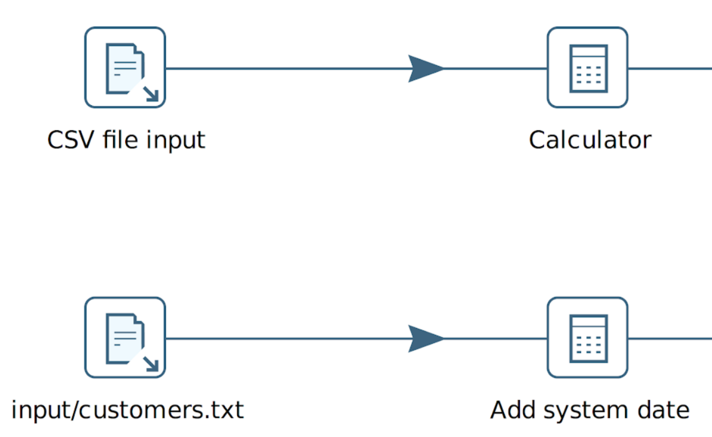

### 命名规范

随着项目的增长，保持组织性的重要性也在增加。一个组织清晰的项目可以更容易地找到 workflow、pipeline 和其他项目文件，并使整个项目更易于维护。

您的命名规范不仅应涵盖项目的所有方面。对于 Qi Hop 来说，这意味着 workflow、pipeline、transform、action 和 metadata 项的命名规范。您的项目不仅仅只有 Qi Hop，项目的其他方面也不例外。如果命名清晰、干净且一致，输入和输出文件、数据库表等的管理将变得容易得多。

对于较大的项目，正式的命名规范文档有助于集中管理命名规范，并避免不同团队成员各自使用不同的命名规范而产生混淆。

命名规范应该被维护、更新、执行和定期验证。可以考虑使用自动化的命名规范检查（例如通过 commit hook 中的脚本）来自动验证您的命名规范。

### Transform 和 action 名称

清晰命名的 transform 和 action 可以使您的 pipeline 和 workflow 更易于理解。

默认的 action 和 transform 名称使用 action 或 transform 的类型名。这使得理解 transform 做什么变得容易，但不会告诉您它在您的 workflow 或 pipeline 中的用途。

`Filter rows`（或者更糟糕的是，`Filter rows 2 2` 或复制/粘贴 transform 后得到的类似名称）不能告诉您任何信息。一个简短而精准的 transform 名称，如 `start_date < today`，可以准确告诉您在过滤器 transform 中发生了什么。

例如，对于输入和输出文件，您可以使用正在读取或写入的文件名。

> **💡 提示:** 您可以在 transform 或 action 的名称中使用（复制/粘贴）任何 Unicode 字符，甚至允许使用换行符。

### Metadata

Metadata 项名称（如关系型数据库连接）应该能直接告诉您它们包含什么数据或它们的用途是什么。

Metadata 项名称不应包含技术或环境细节。

例如，如果您的 CRM 系统运行在 Postgresql 数据库中，`CRM` 作为名称就很好。您的连接已配置为 Oracle 数据库，因此无需在名称中重复。环境信息应该在您的项目生命周期环境中配置，因此无需在连接名称中包含 `dev`、`test` 或 `prod`。

### 项目文件夹和子文件夹

将项目组织在清晰命名的文件夹和子文件夹中，可以使一切更容易查找、组织和维护。避免在单个文件夹中保留数十或数百个 workflow 文件。
