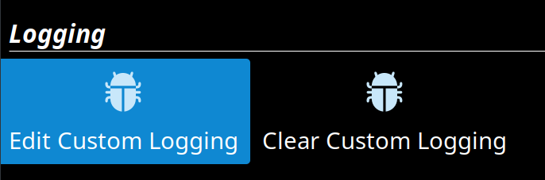
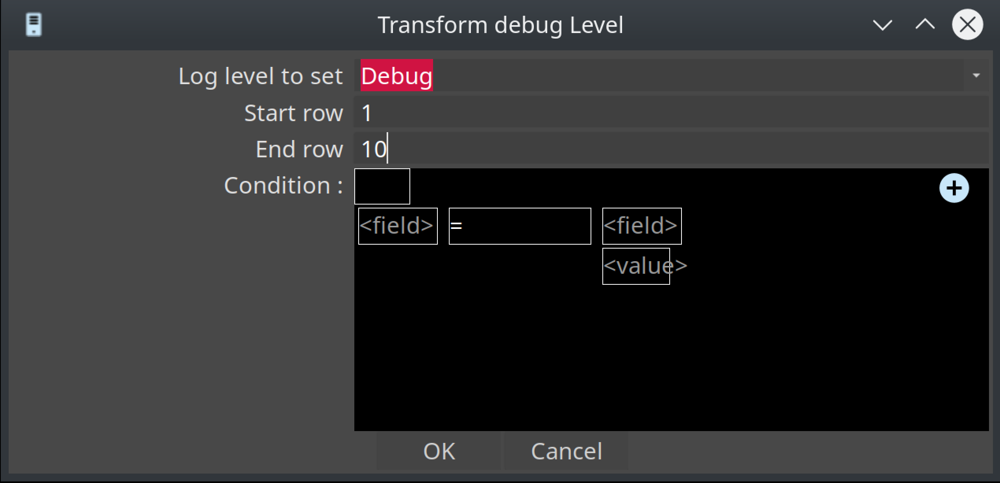
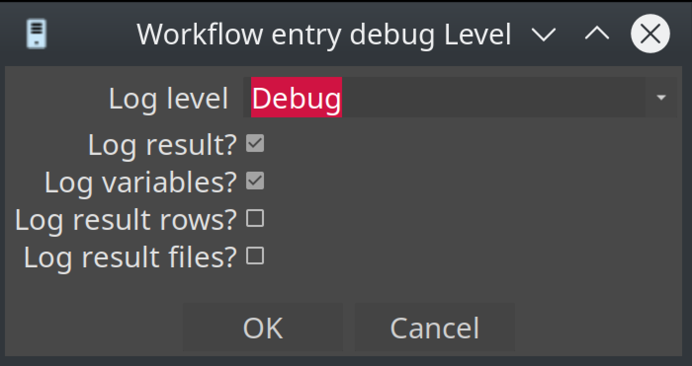

# 日志

你通过 Hop GUI 或 Hop Run 执行的每个 workflow 或 pipeline，以及许多其他工具，都会以最明显的形式生成文本日志。

Hop 允许数据开发者影响日志信息的生成方式、位置、详细程度以及写入位置。

## 级别

### 描述

生成的文本日志量取决于执行 workflow 或 pipeline 时使用的日志级别：

| 级别 | 描述 |
|---|---|
| NOTHING |  |
| 不生成任何日志 |  |
| ERROR |  |
| 仅报告错误 |  |
| MINIMAL |  |
| 仅最基本的日志，没有多余内容 |  |
| BASIC |  |
| 标准日志，力求简洁且信息丰富 |  |
| DETAILED |  |
| 报告更多关于幕后发生的日志信息 |  |
| DEBUG |  |
| 产生大量信息，通常会报告具体值 |  |
| ROWLEVEL |  |
| 在单独的行级别报告值 |  |

### 运行时级别

使用 hop-run 或在 Hop GUI 中执行时可以指定日志级别。
也可以使用调试 plugin 为 Transform 设置自定义日志级别：

你可以为此特定 Transform 且仅针对某些数据行设置自定义日志级别：

你也可以对 workflow 做同样的操作：

## Hop GUI 日志

Hop GUI 的日志文件保存在 `audit/` 文件夹（或由 `HOP_AUDIT_FOLDER` 设置的文件夹）中的 `hopui.log` 文件中。

## 工具日志

如果你想将 hop-run 或 hop-conf 等工具的日志发送到日志文件，只需将文本流通过管道重定向到文件即可。

## 日志 plugin

### Action

#### Write to log

Write to log Action 将特定字符串写入 Hop 日志系统。

查看 [Write To Log](../workflow/actions/writetolog.md) 页面了解更多详情。

### Metadata 类型

#### Pipeline Log

Pipeline Log 允许用另一个 pipeline 记录 pipeline 的活动。

查看 [pipeline log](../metadata-types/pipeline-log.md) 和 [日志反射](../logging/logging-reflection.md) 页面了解更多详情。

#### Workflow Log

允许用 pipeline 记录 workflow 的活动。

查看 [workflow log](../metadata-types/workflow-log.md) 和 [日志反射](../logging/logging-reflection.md) 页面了解更多详情。

### 视图

#### Neo4j

Hop 可以将 workflow 和 pipeline 的执行日志写入 Neo4j 数据库。

查看 [Neo4j Perspective](../hop-gui/perspective-neo4j.md) 页面了解更多详情。

### Transform

#### Write to Log

此 Transform 将信息写入 Hop 日志系统。

查看 [Write To Log](../pipeline/transforms/writetolog.md) 页面了解更多详情。
