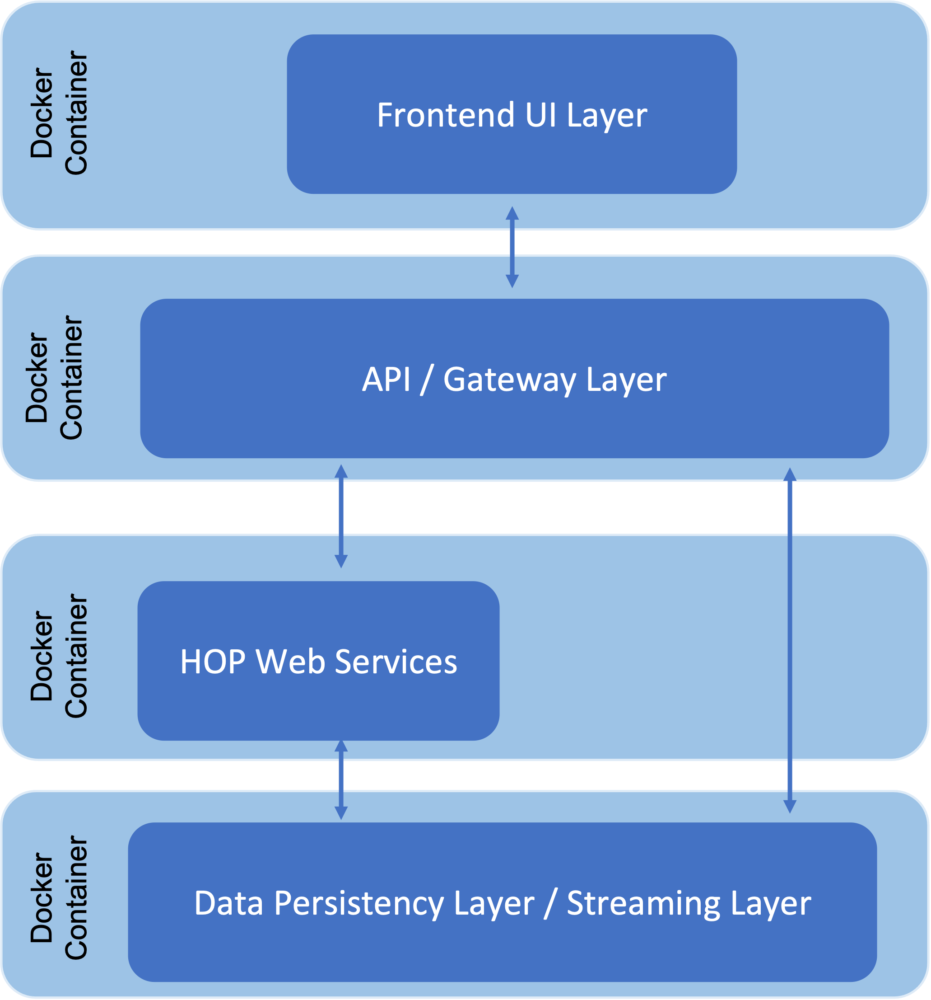
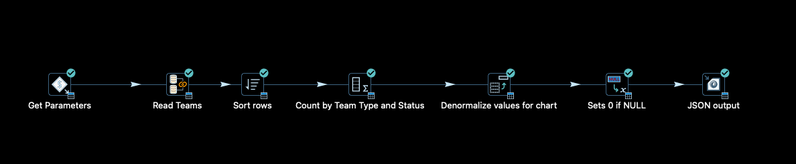
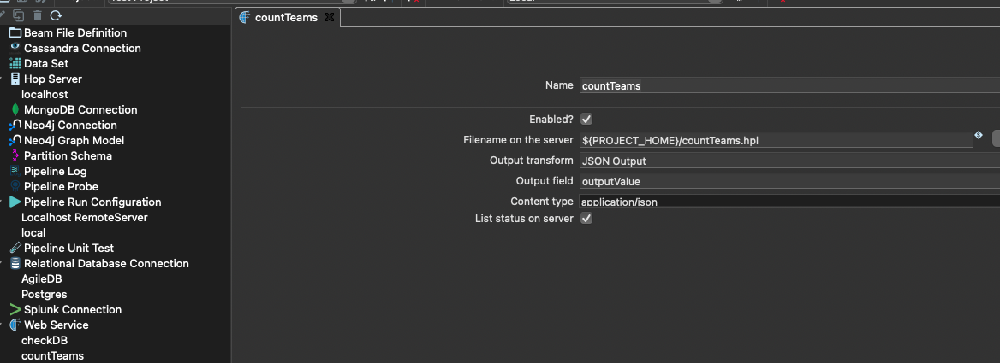
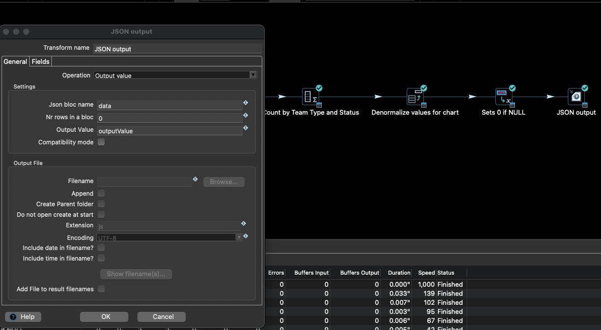
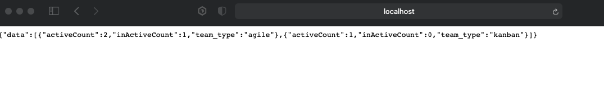

# Qi Hop 中的 Web 服务

## 简介

Qi Hop 是一个非常灵活的工具，用于通过易于使用的 UI 开发数据流（所谓的 pipeline），可以从不同来源提取数据、整合数据并加载到新系统中（ETL）。

该工具不仅非常适合这些经典的数据仓库任务或数据库迁移。在低代码软件开发的背景下，Qi Hop 也可以用于提供快速计算和数据查询作为 Web 服务，而无需大量的编程工作，并将这些计算与您自己的 Web 服务进行链接。数百行源代码被消除了，因为该功能可以在 Qi Hop UI 中通过 pipeline 及其数十个 transform（处理步骤）方便地实现，并集成为 Web 服务。

下图展示了在全栈架构（多容器应用）中 Qi Hop 与 Web 服务集成的示例。



例如，为了从 Java 应用程序调用创建的 Hop Web 服务，需要运行 pipeline 的 Qi Hop Server。Hop Server 提供了一个 Web 界面（servlet）来返回执行结果。

它可以在专用服务器上或 Docker 容器内运行。后一种选项提供了在需要时快速扩展的优势。

## 在 Docker 容器中作为 Web 服务运行 Pipeline

本指南涵盖了创建示例 Web 服务以及随后在 Docker 容器中部署的步骤。

### 步骤 0：Web 服务需求

本教程中虚构示例 Web 服务的任务是为项目仪表板实时提供数据（具体来说：每种团队类型的活跃/非活跃团队数量），以便在 API 层处理后，数据可以以堆叠柱状图的形式在前端显示。数据以规范化形式存在于数据库中，必须首先由 Web 服务进行预处理。

### 步骤 1：创建 pipeline

在 HOP 中创建项目并设置数据库连接后，创建以下 pipeline（文件名：countTeams.hpl）：



该 pipeline 期望项目 ID 作为输入参数，以便能够从数据库中读取属于该项目的团队。数据被分组，然后计算数量，最后按团队类型进行反规范化。执行结果应以 JSON 格式返回。

### 步骤 2：Metadata 配置

要将 pipeline 作为 Web 服务提供，必须为其创建 metadata 并稍后告知 Hop Server。使用 metadata 的优势在于调用应用程序只需知道 Web 服务名称，底层实现的详细信息（特别是 pipeline 的位置）保持隐藏。

在 Web Service 标签页下为 pipeline 创建以下 metadata：



**Name** 字段包含调用应用程序调用服务时使用的 Web 服务名称。**Filename** 字段包含 pipeline 存储位置的分配。**Output transform** 字段包含在要指定的输出字段中提供结果的 transform 的名称。Content type 指定返回流的输出格式。此外，您可以在 metadata 中进一步指定 Web 服务是否应禁用（**Enabled?**）以及执行状态是否应列在 Web Server UI 的统计信息中。

在上面列出的 pipeline 中，Transform JSON Output 的输出字段 outputValue 的内容将作为结果返回：



保存 metadata 后，一切就绪，可以在 Docker 容器中运行 Web 服务了。

### 步骤 3：为不同运行环境设置配置

在 Qi Hop 中，可以通过所谓的配置为不同环境（例如 Development Local、Docker Single、Docker Multi-App）设置运行环境，并将其传递给 pipeline，而无需适配或复制 pipeline 本身（例如每个环境一个 pipeline）。

数据库连接等的连接详细信息（例如 DB Server URL）可以作为变量存储在配置文件中。

例如，要设置一个新的数据库连接，其连接详细信息可能因环境而异，请输入环境变量名称（例如 `{openvar}DB_HOST{closevar}`）而不是具体的服务器 URL。一旦您选择了一个环境并且该变量包含在其配置文件中，DB 配置中的变量将被环境配置中的值替换。

此功能非常有用，例如，在开始部署到 Hop Server 之前针对不同环境测试 pipeline。

此功能对于多容器应用程序（参见上文：全栈架构）也是必不可少的，其服务源于不同且外部隔离的容器的交互。

因此，除了开发环境外，还需要单独的环境配置（在本示例中，`{openvar}DB_HOST{closevar}` 变量将具有 DB Container 的服务名称而不是 DB Server 的 IP 地址）。

### 步骤 4：设置和启动 Docker 容器

要在 Docker 容器内启动 Hop Server，您有以下容器构建选项：

- 使用 Qi Hop 提供的镜像
- 使用 Qi Hop 镜像作为起始镜像，并以新镜像的形式添加应用程序特定的自定义内容（例如包含 Hop 项目及其 workflow 和 pipeline 以及第三方 API）
- 创建完整的自定义镜像（可能基于 Qi Hop Github 仓库中提供的 DOCKERFILES）

根据部署策略，将项目及其源代码包含在镜像中可能是明智的，例如如果在生产环境中只允许部署容器。

第一个选项对于本指南来说足够了，因为示例的所有调整都可以通过环境变量传递到 Docker 容器。
此外，对 pipeline 的更改应立即可见，而无需先重建镜像。
为此，有必要将项目的位置（包括 JDBC 驱动和 metadata 配置的子目录）挂载到 Docker 容器中。

首先下载 Docker 镜像：

```
docker pull apache/hop:<tag>
Example: docker pull apache/hop:1.1.0-SNAPSHOT
```
然后执行容器时，至少必须设置以下环境变量或参数：

| 变量/Docker 参数 | 示例值 | 描述 |
|---|---|---|
| HOP_SERVER_USER | admin | 登录 Hop Server UI 的管理员用户 |
| HOP_SERVER_PASS | admin | 登录 Hop Server UI 的密码 |
| HOP_SERVER_PORT | 8182 | 服务器端口（内部） |
| HOP_SERVER_HOSTNAME | 0.0.0.0 | 主机的 Docker 内部 IP 地址 |
| HOP_PROJECT_NAME | Proj1 | 创建容器时，首先创建一个包含所有必要配置的项目，因此要指定的项目用作占位符。 |
| HOP_PROJECT_FOLDER | /files | 包含项目的根文件夹 |
| HOP_ENVIRONMENT_NAME | Local | 容器启动时要使用的环境名称（例如 local、prod）- 参见步骤 3 |
| HOP_ENVIRONMENT_CONFIG_FILE_NAME_PATHS | /files/config/localTestConfig.json | 所有环境文件的逗号分隔列表（参见步骤 3） |
| HOP_SERVER_METADATA_FOLDER | /files/metadata | 包含 metadata 信息的目录（在本例中为与 Web 服务关联的 metadata）。 |
| HOP_SHARED_JDBC_FOLDERS | /files/jdbc | 包含所有所需 JDBC 驱动（例如 MySQL、Oracle）的目录，这些驱动未包含在标准交付中。这是逗号分隔列表，默认值为 lib/jdbc |
| p | 8182:8182 | 内部 Docker 端口到 Docker 主机端口的映射 |
| V | /my/path/to/location:/files | 挂载路径和到 Docker 内部路径的映射 |
| Name |  | Docker 容器的名称 |

在 Qi Hop 作为 Docker 容器运行的技术文档中（请参阅[文档](https://hop.apache.org/tech-manual/latest/docker-container)），列出了更多参数（例如使用 SSL 时），此处为简化起见已省略。

示例调用：

```
docker run -it --rm \
  --env HOP_SERVER_USER=admin \
  --env HOP_SERVER_PASS=admin \
  --env HOP_SERVER_PORT=8182 \
  --env HOP_SERVER_HOSTNAME=0.0.0.0 \
  --env HOP_PROJECT_NAME=proj1 \
  --env HOP_PROJECT_FOLDER=/files \
  --env HOP_ENVIRONMENT_NAME=Local \
  --env HOP_ENVIRONMENT_CONFIG_FILE_NAME_PATHS=/files/config/localTestConfig.json \
  --env HOP_SERVER_METADATA_FOLDER=/files/metadata \
  --env HOP_SHARED_JDBC_FOLDERS=/files/jdbc \
  -p 8182:8182 \
  -v /my/path/to/location:/files \
  --name test-hop-container \
 apache/hop:1.1.0-SNAPSHOT
```
### 步骤 5：调用 Web 服务

如果容器成功启动，可以通过 http://<IP_HOST>:<PORT_HOST>/hop/status/ 打开 Web 服务器 GUI，登录后（使用传递的管理员 ID）可以查看已调用的 pipeline 和 workflow 概览。

要调用名为 <NameofService> 的 Web 服务，需要以下请求：

`+http://<IP_HOST>:<PORT_HOST>/hop/webService?service=<NameofService>&Param1=Value&Param2=Value2....`

本教程中的 WebService **countTeams** 需要参数 PARAM_PROJECT_ID。

调用方式如下：

`+http://localhost:8182/hop/webService/?service=countTeams&PARAM_PROJECT_ID=63`



如教程开头所述，上面的 API 层现在可以处理 JSON 输出并将其传递给前端，前端然后使用处理后的数据创建图表。

## 结论

通过 metadata 配置可以轻松设置 Qi Hop Pipeline 作为 Web 服务，并通过 Docker 轻松部署。它们适用于任何需要快速同步返回不需要长时间处理的结果的场景。从 1.1 版本开始，Qi Hop 还支持将 workflow 用作 Web 服务。

这里的调用是异步的，即在调用服务时会立即返回要执行的 workflow 的唯一 ID，并在 HOP Server 上后台开始执行（详情请查看[文档](https://hop.apache.org/manual/latest/hop-server/async-web-service)）。
