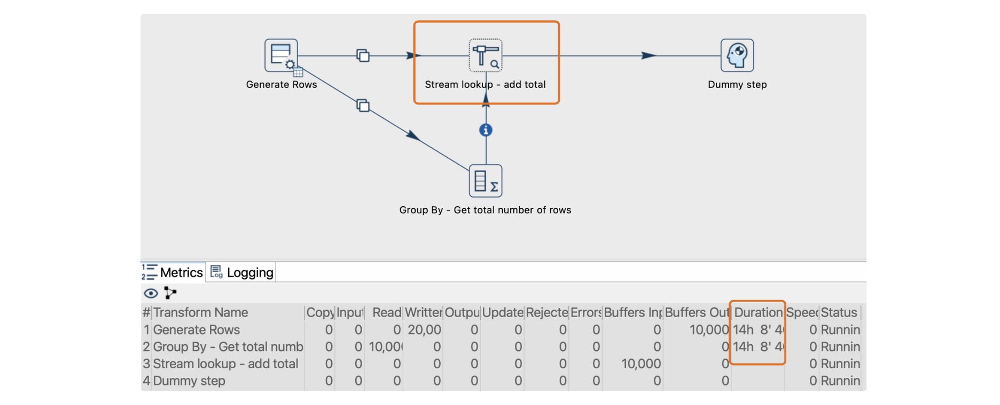
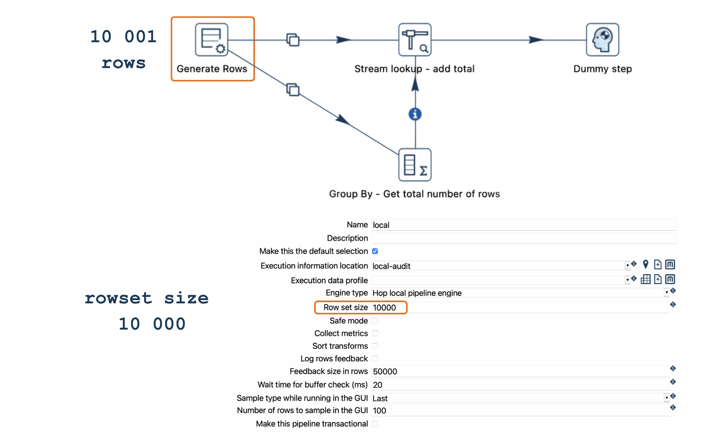
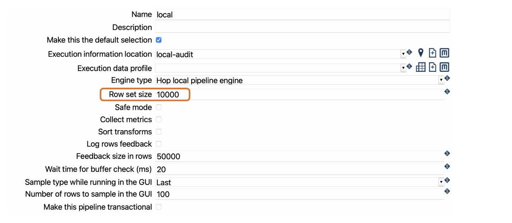
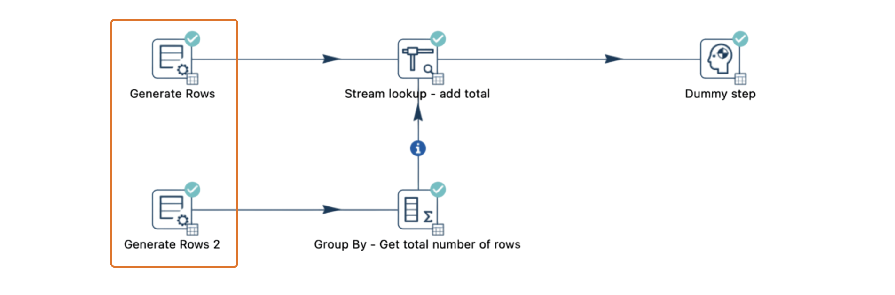
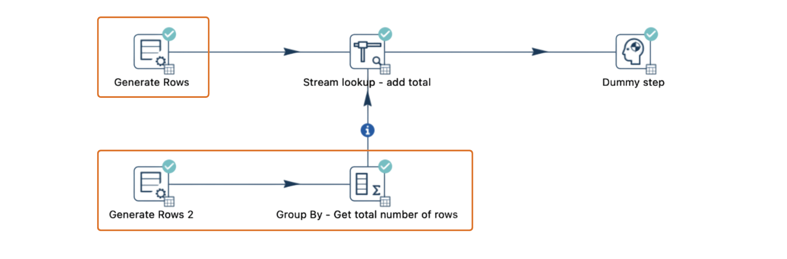
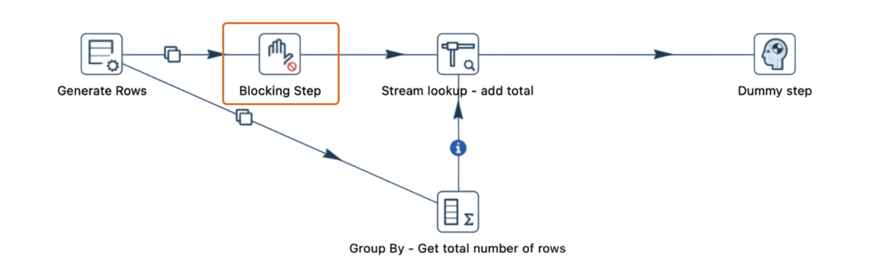
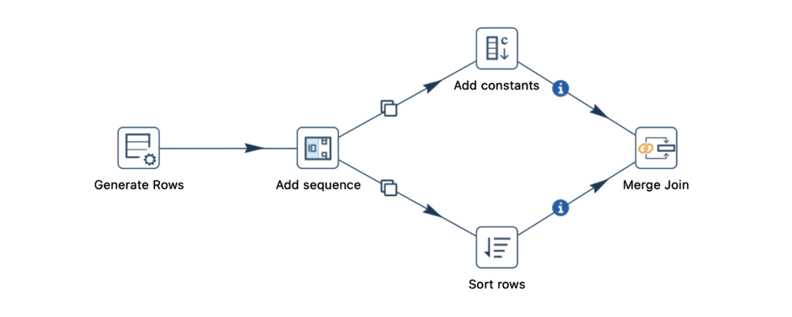
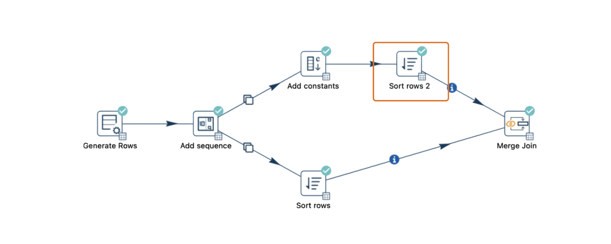
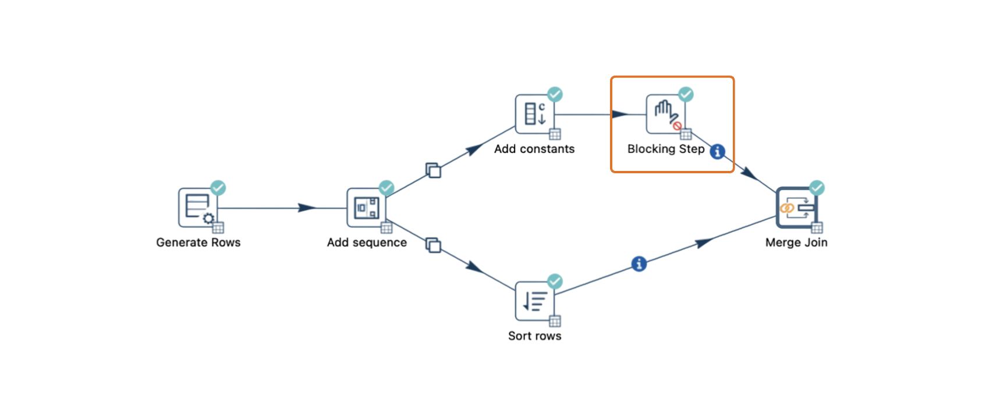

# 避免死锁

在 Qi Hop 中，某些 pipeline 设计可能会遇到死锁（也称为阻塞、停顿或挂起）。死锁的一个常见原因是在处理大型数据集的 pipeline 中使用 [Stream Lookup](pipeline/transforms/streamlookup.md) transform。本指南解释了如何识别、理解和解决涉及 [Stream Lookup](pipeline/transforms/streamlookup.md) 的死锁问题。

## 理解 Pipeline 死锁

当 pipeline 中不同的 transform 相互阻止完成时，Qi Hop 中就会发生死锁，导致 pipeline 无限期停顿。以下因素通常会导致死锁：

- **外部锁**：当数据库对表加锁时，可能会阻止 pipeline 继续。
- **Pipeline 设计问题**：在先前 transform 完成之前会阻塞的 transform 可能会造成死锁，特别是在本地处理大型数据集时。
- **缓冲区限制和 rowset 大小**：具有分流和合并流的 pipeline 依赖于适当的 rowset 大小来避免死锁。

## Stream Lookup Transform 如何导致死锁

在处理大量行的 pipeline 中，[Stream Lookup](pipeline/transforms/streamlookup.md) transform 经常导致死锁。以下是一个说明死锁如何发生的场景：

1. **Pipeline 配置**：该 pipeline 包含一个 `Generate Rows` transform，将数据分成两路，一路直接流向 [Stream Lookup](pipeline/transforms/streamlookup.md) transform，另一路通过中间 transform（如 `Group By`）。
2. **Rowset 限制**：假设本地 Pipeline 运行配置的 Rowset 大小设置为 10,000 行，这意味着每个 hop 最多可以在 transform 之间临时存储 10,000 行。
3. **溢出**：如果 pipeline 生成 10,001 行，rowset 缓冲区将达到其 10,000 行的容量，导致 pipeline 暂停，直到下游 transform 处理一些行。

当 [Stream Lookup](pipeline/transforms/streamlookup.md) 等待来自两路流的数据但遇到其中一路的缓冲区已满时，两路流都无法继续，导致整个 pipeline 死锁。

## 避免死锁的解决方案

### 1. 调整 Rowset 大小（需谨慎）

增大 rowset 大小可以通过缓冲更多行来提供短期修复，但应谨慎使用。更大的 rowset 会增加内存使用量，并可能降低大型数据集的性能。

- Pipeline 使用 Pipeline 运行配置，其中指定了引擎类型。
- 如果使用 `Local` 引擎类型，可以修改 `Rowset size` 选项以匹配您的数据集和 pipeline 设计要求。

### 2. 分离输入流

更有效的解决方案是将输入数据流分成两个独立的副本，允许每路流独立操作。这避免了单路流中 transform 瓶颈导致的死锁，并允许 [Stream Lookup](pipeline/transforms/streamlookup.md) 顺畅运行。

### 3. 将 pipeline 拆分为更小的单元

将 pipeline 拆分为更小的、独立的 pipeline，允许您分阶段处理数据，使用中间表或文件进行数据交接。这种模块化方法在避免与缓冲区相关的死锁方面非常有效，特别是在具有多个流连接的 pipeline 中。

### 4. 使用 Blocking transform

对于需要顺序处理的 pipeline，"Blocking" transform 可以通过确保一路流完全完成后再进入下一步来管理流控制。

- 配置 Blocking transform 的 `Pass all rows` 选项以顺序方式处理流。
- 在 Blocking transform 中调整缓存大小等设置以获得最佳性能。

### Merge Join Transform 如何导致死锁

死锁也可能发生在 [Merge Join](pipeline/transforms/mergejoin.md) transform 中，特别是在处理大型数据集或在本地运行 pipeline 时。以下是一个示例场景，展示了 *Merge Join* transform 可能如何导致死锁：

1. **Pipeline 配置**：该 pipeline 生成行，分成两路流，然后在 [Merge Join](pipeline/transforms/mergejoin.md) transform 处合并。一路流直接流向 *Merge Join*，另一路流经过 *Add Constants* transform 然后经过 *Sort Rows* transform。
2. **Rowset 限制**：假设本地 Pipeline 运行配置的 Rowset 大小设置为 10,000 行。如果此 pipeline 生成 20,003 行，两路流可能会超过总共 20,000 行的组合缓冲区容量（每个 hop 10,000 行），导致 pipeline 停顿。
3. **死锁触发**：随着 rowset 填满，*Merge Join* 可能会等待来自两个已排序流的行。但是，如果一路流的缓冲区已满，两路流都无法继续，从而导致死锁。

#### 避免 Merge Join 死锁的解决方案

===== 1. 调整 Rowset 大小（需谨慎）

正如我们在前面的示例中提到的，增大 rowset 大小可以临时缓冲更多行，这可能在小数据量下防止死锁。但是，更大的 rowset 会增加内存使用量，并可能降低性能，特别是对于较大的数据集。

- 打开 pipeline 的 Pipeline 运行配置，其中设置了引擎类型。
- 使用 `Local` 引擎类型时，调整 `Rowset size` 选项以适合您的数据大小和 pipeline 设计。

===== 2. 合并前对两路流排序

确保两路输入流在到达 *Merge Join* transform 之前都已排序。排序使行能够顺畅、有序地流动，减少缓冲区溢出和随后死锁的可能性。

- 在加入两路流之前，对每路流使用 *Sort Rows* transform。
- 如果数据来自数据库且使用一致的数据类型，在数据库内排序可能就足够了。

===== 3. 使用 Blocking Transform

对于需要顺序处理的 pipeline，[Blocking](pipeline/transforms/blockingtransform.md) transform 可以帮助管理流控制。配置它以在一路流中处理所有行，然后再将它们释放到下一个 transform。

- 设置 Blocking transform 的 *Pass all rows* 选项以启用顺序行处理。
- 根据需要在 Blocking transform 设置中微调 *cache size* 以获得最佳性能。
