# Pipeline Log

当您的项目经过初始开发和测试后，了解运行时发生了什么变得很重要。

Qi Hop Pipeline Log 允许使用另一个 pipeline 来记录 pipeline 的活动。Pipeline Log 将日志信息从运行中的 pipeline 流式传输到另一个 pipeline。Pipeline Log 将以 JSON 格式创建。

Hop 会将您运行的每个 pipeline 的日志信息传递给您指定为 pipeline log metadata 对象的 pipeline。在本文中，我们将看一个示例，了解如何配置和使用 pipeline log metadata 将 pipeline 日志信息写入关系型数据库。

这里的示例遵循最佳实践，在 Qi Hop 项目中使用变量来分离代码和配置。

## 步骤 1：创建 Pipeline Log metadata 对象

要创建 **Pipeline Log**，请点击 **New -> Pipeline Log** 选项，或点击 **Metadata -> Pipeline Log** 选项。

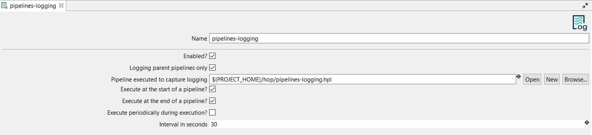

系统显示 **New Pipeline Log** 视图，包含以下需要配置的字段。

Pipeline Log 可以按以下示例进行配置：

- Name：metadata 对象的名称（pipelines-logging）。
- Enabled：（已勾选）。
- Pipeline executed to capture logging：选择或创建用于处理此 Pipeline Log 日志信息的 pipeline `({openvar}PROJECT_HOME{closevar}/hop/logging/pipelines-logging.hpl)`。

接下来，选择或创建用于记录活动日志的 pipeline。我们稍后会创建一个 pipeline，需要注意的是您可以使用 Qi Hop pipeline 的所有功能来处理日志数据。唯一的前提是此 pipeline 中的第一个 transform 需要以 [pipeline logging transform](../03-转换插件/其他转换/pipeline-logging.md) 开始。

- Execute at the start of the pipeline?：（已勾选）。
- Execute at the end of the pipeline?：（已勾选）。
- Execute periodically during execution?：（未勾选）

最后，保存 Pipeline Log 配置。

> **💡 提示:** pipeline 日志将应用于您在当前项目中运行的任何 pipeline。这可能不是必需的甚至不是期望的。如果您只想为选定的 pipeline 处理日志信息，可以在配置选项下方的表格中（"Capture output of the following pipelines"）添加 pipeline 选择。下面的截图显示了默认 Qi Hop 示例项目中仅捕获单个 "generate-fake-books.hpl" pipeline 日志的配置。

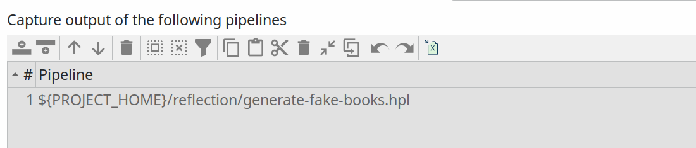

## 步骤 2：创建带有 Pipeline Logging transform 的新 pipeline

要创建 pipeline，您可以转到视图区域或点击 New Pipeline Log 对话框中的 New 按钮。然后选择 pipeline 的文件夹和名称。

新 pipeline 会自动创建一个 Pipeline Logging transform 并连接到 [Dummy transform](../04-动作插件/其他动作/dummy.md)（Save logging here）。

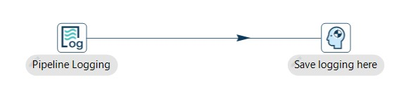

现在可以配置 Pipeline Logging transform 了。此配置非常简单，打开 transform 并按以下示例设置您的值：

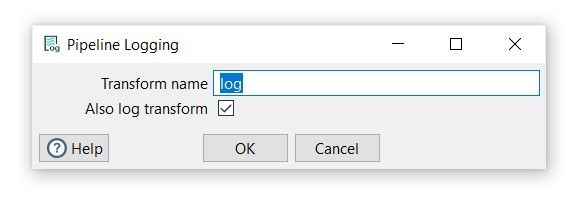

- Transform name：为您的 transform 选择一个名称，只需记住 transform 的名称在 pipeline 中应该是唯一的（log）。
- Also log transform：默认选中。

## 步骤 3：添加和配置 Table output transform

[Table Output](../03-转换插件/输出类/tableoutput.md) transform 允许您将数据加载到数据库表中。Table Output 等同于 DML 操作符 INSERT。此 transform 提供了目标表的配置选项以及许多维护和/或性能相关的选项，如 Commit Size 和 Use batch update for inserts。

> **💡 提示:** 在此示例中，我们将使用关系型数据库连接来记录日志，但您也可以使用输出文件。如果您决定使用数据库连接，请检查安装和可用性作为前提条件。

通过点击 pipeline 画布上的任意位置添加 Table Output transform，然后搜索 'table output' -> Table Output。

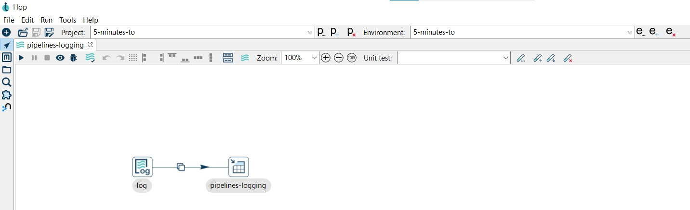

现在可以配置 Table Output transform 了。打开 transform 并按以下示例设置您的值：

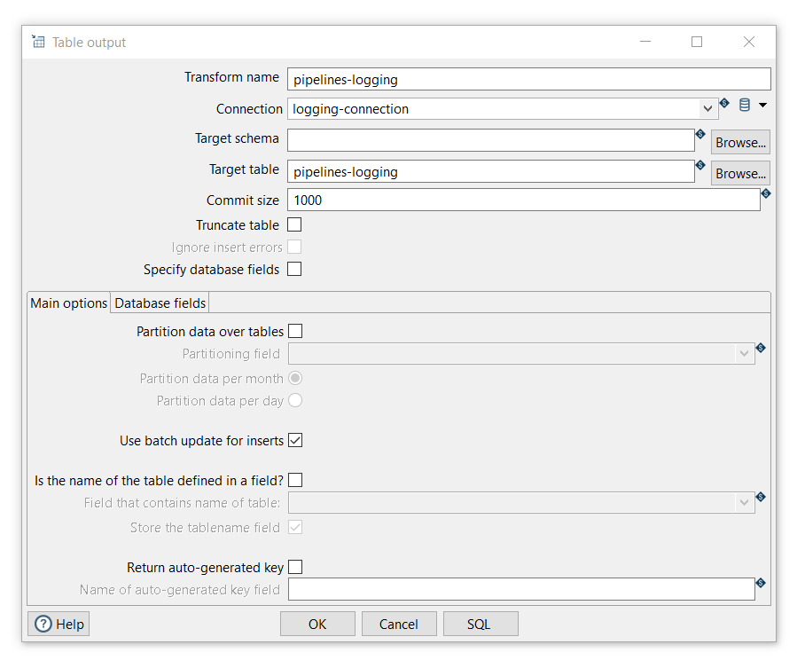

Transform name：为您的 transform 选择一个名称，只需记住 transform 的名称在 pipeline 中应该是唯一的（pipelines logging）。

- Connection：数据将写入的数据库连接（logging-connection）。该连接通过包含以下变量的 logging-connection.json 环境文件进行配置：

- Target table：数据将写入的表的名称（pipelines-logging）。
- 点击 SQL 选项以自动生成创建输出表的 SQL：

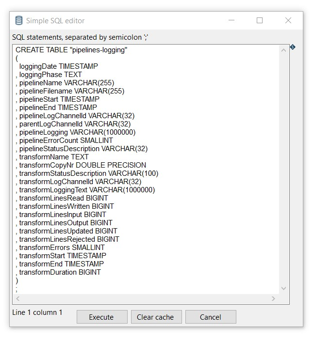

- 执行 SQL 语句：

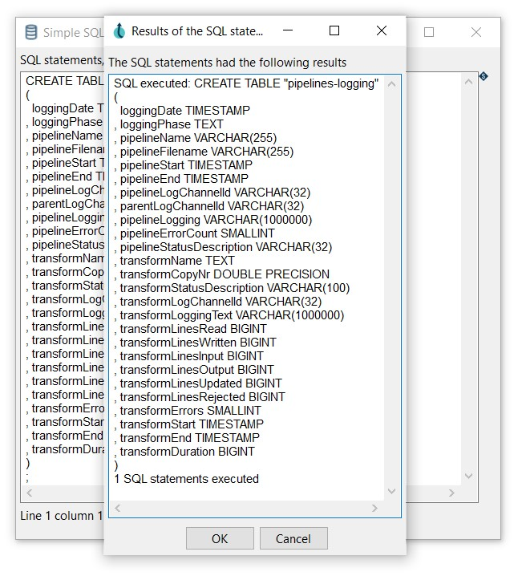

- 在您喜欢的数据库浏览器（如 DBeaver）中打开创建的表，查看所有日志字段：

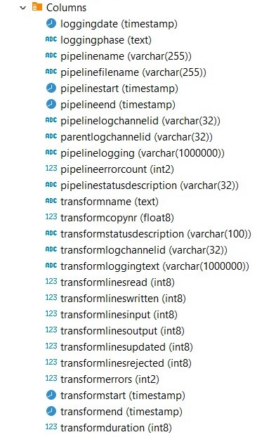

- 关闭并保存 pipeline。

## 步骤 4：运行 pipeline 并检查日志

最后，通过点击 **Run -> Launch** 选项来运行 pipeline。在此例中，我们使用一个基础 pipeline（generate-rows.hpl），它生成一个常量并将 1000 行写入 CSV 文件：

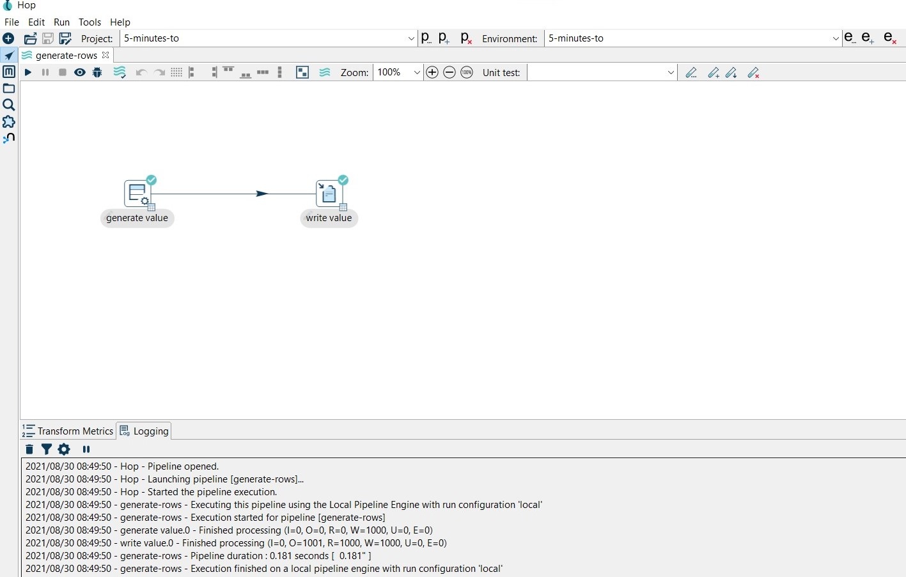

Pipeline 执行的数据将记录在 pipelines-logging 表中。

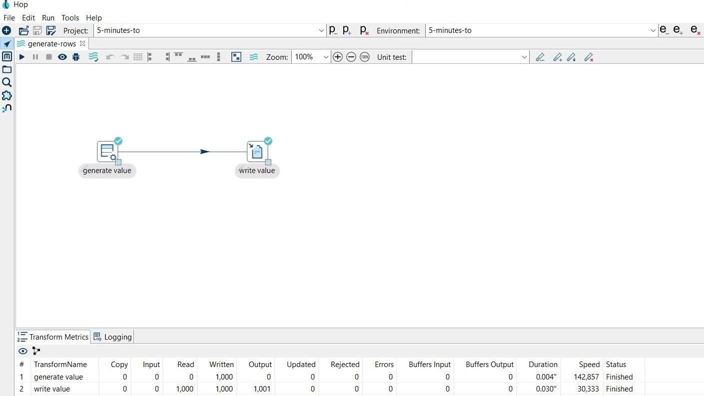

检查 pipelines-logging 表中的数据。

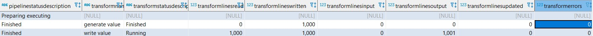

## 后续步骤

您现在知道了如何使用 pipeline log metadata 类型来利用 Qi Hop 提供的一切功能来处理您的 pipeline 日志信息。

请查看 [workflow log](logging-workflow-log.md) 的相关页面，了解如何设置类似的流程来处理 workflow 日志。
