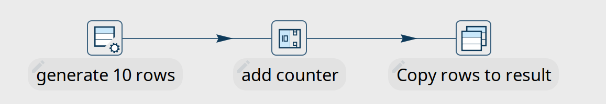
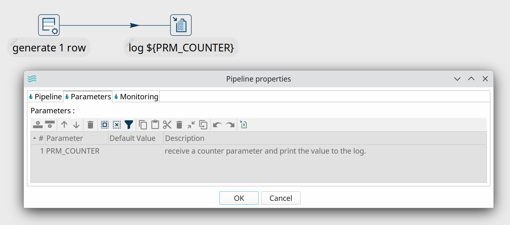
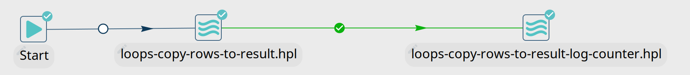
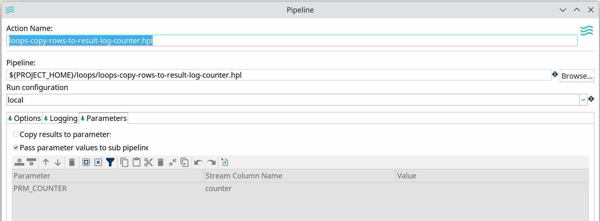
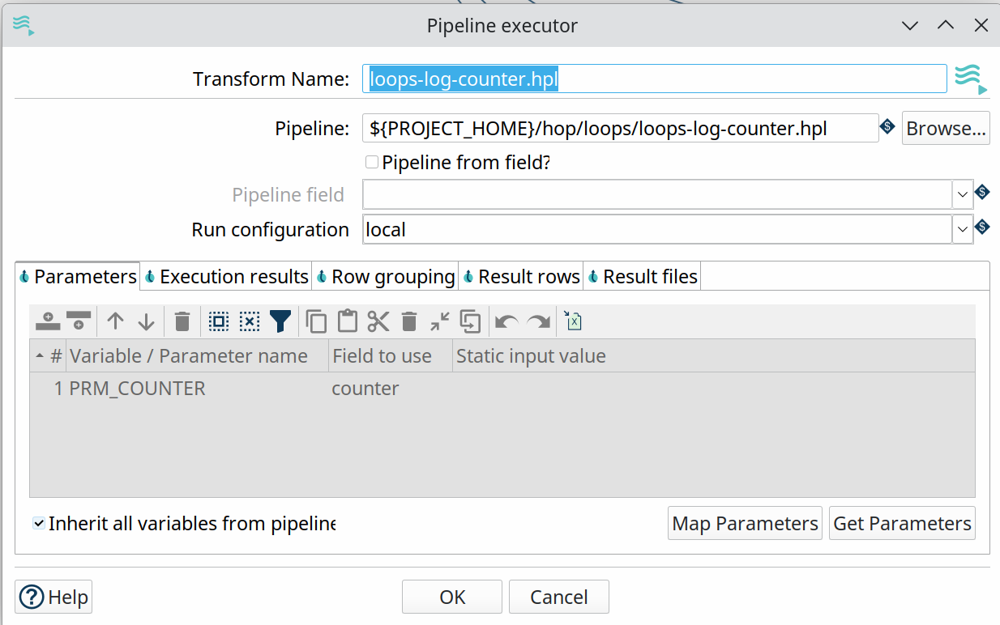
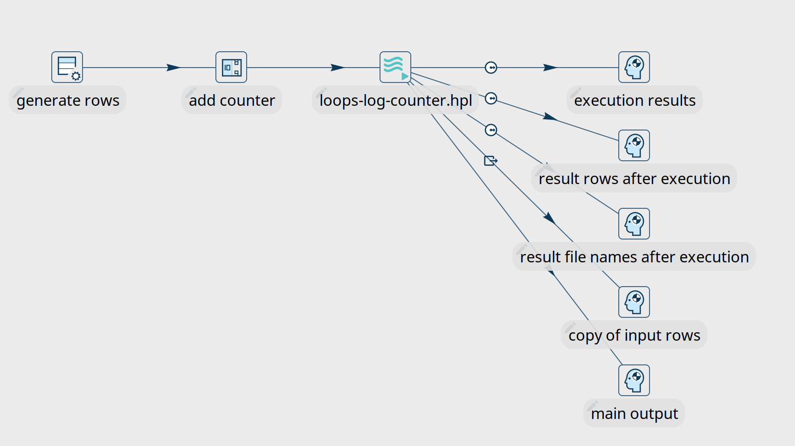
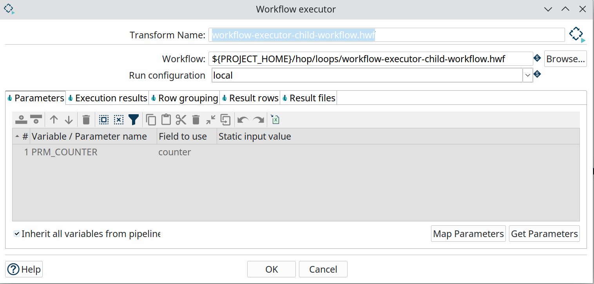
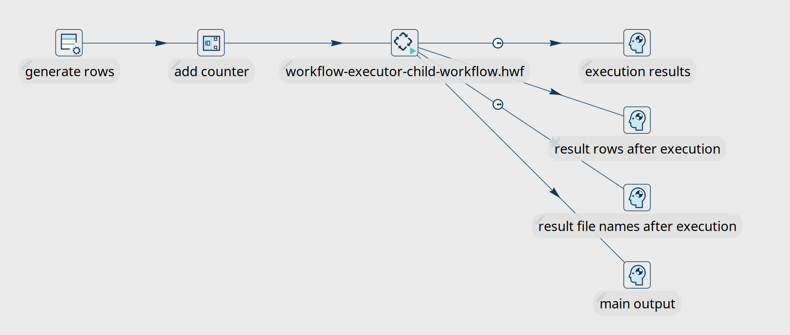
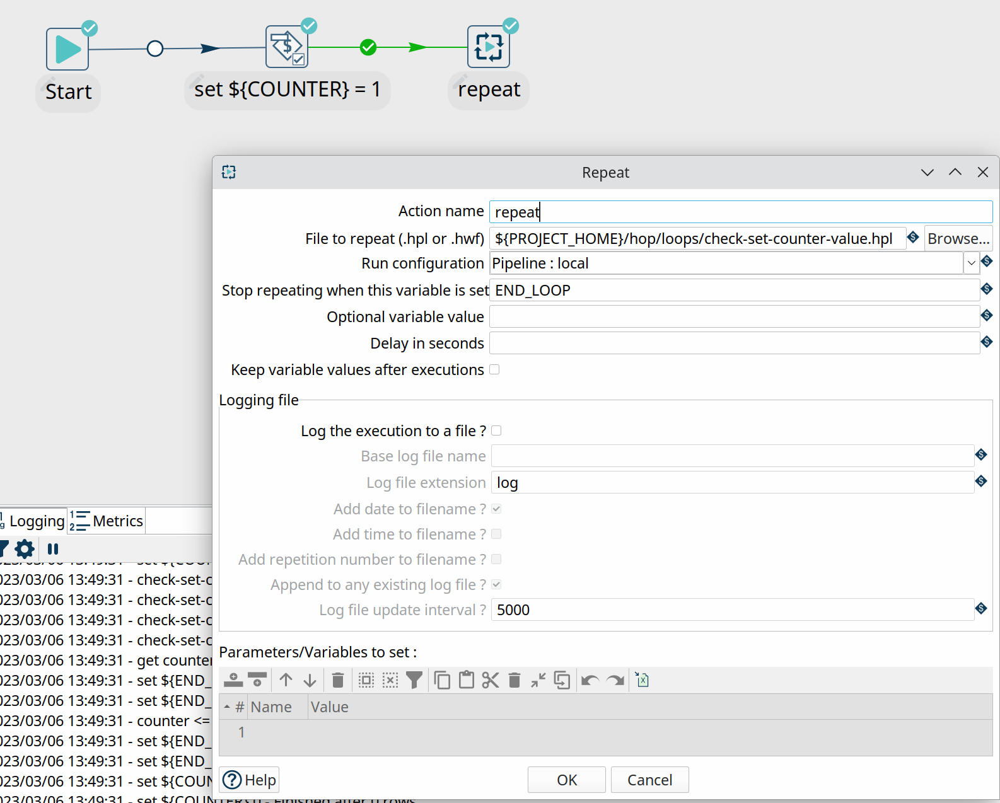
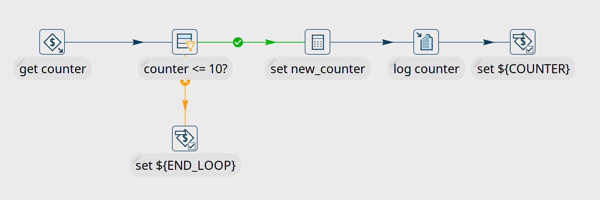

# Qi Hop 中的循环

在任何数据工程项目中，都有很多用例需要让相同的流程运行多次，例如遍历多个文件夹、为数据范围中的每个可用月份运行等。

Qi Hop 提供了多种方式来循环执行相同的 workflow 或 pipeline。让我们仔细看看不同的选项。

## 已弃用：copy rows to result + execute for each row

如本节标题所述，此选项已弃用，仅因历史原因在 Qi Hop 中保留。**不要**在新的开发中使用此选项。它确实可以工作，但更难弄清楚您的 pipeline 或 workflow 内部发生了什么。如果您的项目中有这种类型的循环（例如作为导入的 Pentaho Data Integration (Kettle) 项目的一部分），请查看本指南中构建循环的其他方式来重构这些循环。

在这种场景中，您至少需要三个 Qi Hop 文件：

- 在第一个 pipeline 中，我们将构建一个要循环遍历的值列表。这些行通过 Copy rows to result transform 放入内存。
- 在第二个 pipeline 中，我们将消耗循环中的每个值。循环中的每个值在此 pipeline 中作为参数被接收。
- 两个 pipeline 都由一个 workflow 执行。第一个 pipeline action 将要循环遍历的值放入内存。在第二个 pipeline action 中，我们将启用 `Execute for every result row` 选项，并将复制到内存的字段名作为 `Stream column name` 参数传递给处理循环值的 pipeline。

这是一个非常基础的示例：



创建 10 行带计数器的数据用于循环遍历。将这些行复制到内存。

单独处理循环中的每个值。此示例将循环值作为 `${openvar}PRM_COUNTER${closevar}` 参数接收并打印到日志。



两个 pipeline 都从 workflow 中执行。



此 workflow 中的第二个 pipeline action 迧行处理循环值的 pipeline。`Execute for every result row` 选项为我们在第一个 pipeline 中放入内存的每个计数值运行此 pipeline。



此 workflow 的日志看起来类似于以下输出：

```
2023/04/24 11:25:07 - Hop - Starting workflow
2023/04/24 11:25:07 - loops-process-rows-from-memory - Start of workflow execution
2023/04/24 11:25:07 - loops-process-rows-from-memory - Starting action [loops-copy-rows-to-result.hpl]
2023/04/24 11:25:07 - loops-copy-rows-to-result.hpl - Using run configuration [local]
2023/04/24 11:25:07 - loops-copy-rows-to-result - Executing this pipeline using the Local Pipeline Engine with run configuration 'local'
2023/04/24 11:25:07 - loops-copy-rows-to-result - Execution started for pipeline [loops-copy-rows-to-result]
2023/04/24 11:25:07 - generate 10 rows.0 - Finished processing (I=0, O=0, R=0, W=10, U=0, E=0)
2023/04/24 11:25:07 - add counter.0 - Finished processing (I=0, O=0, R=10, W=10, U=0, E=0)
2023/04/24 11:25:07 - Copy rows to result.0 - Finished processing (I=0, O=0, R=10, W=10, U=0, E=0)
2023/04/24 11:25:07 - loops-copy-rows-to-result - Pipeline duration : 0.052 seconds [ 0.052" ]
2023/04/24 11:25:07 - loops-process-rows-from-memory - Starting action [loops-copy-rows-to-result-log-counter.hpl]
...
...
2023/04/24 11:25:07 - loops-copy-rows-to-result-log-counter - Executing this pipeline using the Local Pipeline Engine with run configuration 'local'
2023/04/24 11:25:07 - loops-copy-rows-to-result-log-counter - Execution started for pipeline [loops-copy-rows-to-result-log-counter]
2023/04/24 11:25:08 - generate 1 row.0 - Finished processing (I=0, O=0, R=0, W=1, U=0, E=0)
2023/04/24 11:25:08 - log ${PRM_COUNTER}.0 -
2023/04/24 11:25:08 - log ${PRM_COUNTER}.0 - ------------> Linenr 1------------------------------
2023/04/24 11:25:08 - log ${PRM_COUNTER}.0 - #################################
2023/04/24 11:25:08 - log ${PRM_COUNTER}.0 - the vaule for PRM_COUNTER is now 10
2023/04/24 11:25:08 - log ${PRM_COUNTER}.0 - #################################
2023/04/24 11:25:08 - log ${PRM_COUNTER}.0 -
2023/04/24 11:25:08 - log ${PRM_COUNTER}.0 -
2023/04/24 11:25:08 - log ${PRM_COUNTER}.0 -
2023/04/24 11:25:08 - log ${PRM_COUNTER}.0 - ====================
2023/04/24 11:25:08 - log ${PRM_COUNTER}.0 - Finished processing (I=0, O=0, R=1, W=1, U=0, E=0)
2023/04/24 11:25:08 - loops-copy-rows-to-result-log-counter - Pipeline duration : 0.035 seconds [ 0.035" ]
2023/04/24 11:25:08 - loops-process-rows-from-memory - Finished action [loops-copy-rows-to-result-log-counter.hpl] (result=[true])
2023/04/24 11:25:08 - loops-process-rows-from-memory - Finished action [loops-copy-rows-to-result.hpl] (result=[true])
2023/04/24 11:25:08 - loops-process-rows-from-memory - Workflow execution finished
2023/04/24 11:25:08 - Hop - Workflow execution has ended
2023/04/24 11:25:08 - loops-process-rows-from-memory - Workflow duration : 0.65 seconds [ 0.650" ]
2023/04/24 11:25:08 - loops-copy-rows-to-result-log-counter - Execution finished on a local pipeline engine with run configuration 'local'
```
您可能已经注意到，这种循环方式不是很透明。无法直接获取您想要传递给第二个 pipeline 的流值。如果您想清楚地了解循环中发生了什么，您需要将信息记录到日志中。所有这些加在一起使得维护和调试这种类型的循环变得困难。

## Pipeline 和 Workflow Executor

[Workflow executor^](../03-转换插件/其他转换/workflow-executor.md) 和 [Pipeline executor^](../03-转换插件/其他转换/pipeline-executor.md) 提供了灵活而优雅的方式，可以从现有 pipeline 中运行 workflow 和 pipeline。

### Pipeline Executor

Pipeline executor 是一个相对简单但非常强大的 transform。

指定要执行的 pipeline 名称（或从字段中接受 pipeline 名称），指定运行配置，将子 pipeline 的参数映射到当前 pipeline 中的字段，就完成了。

Pipeline executor transform 默认会逐行将数据发送到子 pipeline。可以通过 `Row grouping` 标签页更改此默认行为。如果向子 pipeline 发送多行数据，请在子 pipeline 中使用 [Get rows from result^](../03-转换插件/其他转换/getrowsfromresult.md) transform 来获取这些行。

遍历值列表以发送到子 pipeline 不一定是您想在主 pipeline 中执行的最后一个操作。

有 5 种方式可以创建从 pipeline executor transform 到 pipeline 中后续 transform 的 hop。





#### Pipeline Executor - 执行结果

此 hop 类型返回各个子 pipeline 运行的执行结果和指标。

建议至少检查 `ExecutionResult`、`ExecutionExitStatus` 或 `ExecutionNrErrors` 字段，以查看子 pipeline 中是否有任何问题。

| 字段名 | 类型 | 描述 |
|---|---|---|
| ExecutionTime | Integer | 执行子 pipeline 所花费的时间 |
| ExecutionResult | Boolean | 子 pipeline 执行的结果 (Y/N) |
| ExecutionNrErrors | Integer | 子 pipeline 执行中遇到的错误数 |
| ExecutionLinesRead | Integer | 从先前 transform 读取的行数（在子 pipeline 中） |
| ExecutionLinesWritten | Integer | 写入后续 transform 的行数（在子 pipeline 中） |
| ExecutionLinesInput | Integer | 从物理 I/O（如文件或数据库）读取的行数 |
| ExecutionLinesOutput | Integer | 写入物理 I/O（如文件或数据库）的行数 |
| ExecutionLinesRejected | Integer | 子 pipeline 中被拒绝的行数 |
| ExecutionLinesUpdated | Integer | 子 pipeline 中更新的行数 |
| ExecutionLinesDeleted | Integer | 子 pipeline 中删除的行数 |
| ExecutionFilesRetrieved | Integer | 子 pipeline 中检索的文件数 |
| ExecutionExitStatus | Integer | 子 pipeline 的退出状态 |
| ExecutionLogText | String | 子 pipeline 执行的完整日志文本 |
| ExecutionLogChannelId | String | 子 pipeline 执行的日志通道 ID |

#### Pipeline Executor - 执行后的结果行

此行集接收子 pipeline 复制到内存中的数据，例如通过 Copy rows to result transform。在 pipeline executor transform 中使用 "Result rows" 标签页指定您期望从子 pipeline 接收的字段。

#### Pipeline Executor - 执行后的结果文件名

此行集将包含复制到结果中的任何文件名，例如通过 [Text file input^](../03-转换插件/输入类/textfileinput.md) transform 的 `Content` 标签页中的 `Add filenames to result`。

#### Pipeline Executor - Executor transform 输入数据的副本

此行集传递 pipeline executor transform 接收到的数据流。

#### Pipeline Executor - transform 的主输出

此行集模拟 pipeline executor transform 的输入。

### Workflow Executor

Workflow executor transform 类似于 pipeline executor transform，但正如名称所示，它允许您从 pipeline 中运行 workflow。

指定要执行的 workflow 名称，指定运行配置，将子 workflow 的参数映射到 pipeline 中的字段，就完成了。

Workflow executor transform 默认会逐行将数据发送到 workflow。可以通过 `Row grouping` 标签页更改此默认行为。

同样，与 pipeline executor transform 类似，遍历值列表以发送到子 workflow 不一定是您想在主 pipeline 中执行的最后一个操作。

有 4 种方式可以创建从 workflow executor transform 到 pipeline 中后续 transform 的 hop。





#### Workflow Executor - 执行结果

此 hop 类型返回各个子 workflow 运行的执行结果和指标。

建议至少检查 `ExecutionResult`、`ExecutionExitStatus` 或 `ExecutionNrErrors` 字段，以查看子 workflow 运行中是否有任何问题。

| 字段名 | 类型 | 描述 |
|---|---|---|
| ExecutionTime | Integer | 执行子 workflow 所花费的时间 |
| ExecutionResult | Boolean | 子 workflow 执行的结果 (Y/N) |
| ExecutionNrErrors | Integer | 子 workflow 执行中遇到的错误数 |
| ExecutionLinesRead | Integer | 从先前 transform 读取的行数（在子 workflow 中） |
| ExecutionLinesWritten | Integer | 写入后续 transform 的行数（在子 workflow 中） |
| ExecutionLinesInput | Integer | 从物理 I/O（如文件或数据库）读取的行数 |
| ExecutionLinesOutput | Integer | 写入物理 I/O（如文件或数据库）的行数 |
| ExecutionLinesRejected | Integer | 子 workflow 中被拒绝的行数 |
| ExecutionLinesUpdated | Integer | 子 workflow 中更新的行数 |
| ExecutionLinesDeleted | Integer | 子 workflow 中删除的行数 |
| ExecutionFilesRetrieved | Integer | 子 workflow 中检索的文件数 |
| ExecutionExitStatus | Integer | 子 workflow 的退出状态 |
| ExecutionLogText | String | 子 workflow 执行的完整日志文本 |
| ExecutionLogChannelId | String | 子 workflow 执行的日志通道 ID |

#### Workflow Executor - 执行后的结果行

此行集接收子 workflow 复制到内存中的数据。在 workflow executor transform 中使用 `Result rows` 标签页指定您期望从子 workflow 接收的字段。

#### Workflow Executor - 执行后的结果文件名

此行集将包含子 workflow 复制到结果中的任何文件名。

#### Workflow Executor - transform 的主输出

此行集模拟 workflow executor transform 的输入。

## Repeat 和 End Repeat action

除了 workflow 和 pipeline executor transform 之外，[Repeat^](../04-动作插件/工作流控制类/repeat.md) 和 [End Repeat^](../04-动作插件/其他动作/repeat-end.md) action 允许您从 workflow 构建循环。

Repeat action 本身非常简单：它需要一个 workflow 或 pipeline 以及要使用的运行配置。

该 action 将继续执行指定的 workflow 或 pipeline，直到满足条件：要么设置了一个带有（可选）值的变量，要么在子 workflow 中触发了 `End repeat` action。

下面的示例运行一个 pipeline，每次运行时递增 `${openvar}COUNTER${closevar}` 变量。如果变量值超过 10，则设置变量 `${openvar}END_LOOP${closevar}`。Repeat action 检测到此变量，循环停止。





## 总结

这里讨论的选项为您提供了在 Qi Hop 项目中构建和运行循环所需的所有工具。

这里讨论的所有示例都可以在 Qi Hop 安装中的 `samples` 项目中找到（从 Qi Hop 2.5.0 开始）。

如果您从 Pentaho Data Integration (Kettle) 升级了项目或打算升级，现在是时候将您已弃用的 `Copy rows to result` 循环重构为这里讨论的任何选项了。
