# 在 Apache Airflow 中运行 workflow 和 pipeline

## 什么是 Apache Airflow？

来自 [Apache Airflow 网站](https://airflow.apache.org/)：

Airflow 是一个由社区创建的平台，用于以编程方式编写、调度和监控 workflow。

Airflow 使用有向无环图（或 [DAG](https://airflow.apache.org/docs/apache-airflow/1.10.10/concepts)）。DAG 是您要运行的所有任务的集合，以反映它们的关系和依赖关系的方式组织。

DAG 在 Python 脚本中定义，该脚本以代码形式表示 DAG 结构（任务及其依赖关系）。

从 Qi Hop 的角度来看，我们的关注点不同：Qi Hop 希望让公民开发者成为高效的数据工程师，而无需编写代码。考虑到这一点，我们不需要 Apache Airflow 提供的所有花哨功能（但不要让这阻止您充分利用 Apache Airflow！）。

## 在 Docker Compose 中运行 Apache Airflow

本页面的目标是搭建一个基础的 Airflow 环境，以演示 Apache Airflow 和 Qi Hop 如何协同使用。如果您想构建生产就绪的 Apache Airflow 安装，请查看不同的[安装选项](https://airflow.apache.org/docs/apache-airflow/stable/installation/index)。

为了保持简单，我们将使用 Docker Compose 在几分钟内启动并运行 Apache Airflow。尽管 [Docker Compose](https://docs.docker.com/compose/) 被说了很久即将消亡，但它仍然是试验数据平台的快速便捷方式，否则这些平台将耗时且难以设置。

Apache Airflow 提供了一个 [docker-compose.yaml](https://airflow.apache.org/docs/apache-airflow/2.9.1/docker-compose.yaml) 文件。我们的目标是在 Apache Airflow 中运行 Qi Hop workflow 和 pipeline，因此我们对这个 docker-compose 文件附带的 Airflow 示例 DAG 不感兴趣。

在默认文件中将 **AIRFLOW\__CORE__LOAD_EXAMPLES** 变量更改为 "false"，并在 volumes 部分添加一行 **/var/run/docker.sock:/var/run/docker.sock**。
如果您使用我们 GitHub 仓库中的[文件](https://github.com/apache/hop/tree/master/docs/hop-user-manual/modules/ROOT/assets/files/how-to-guides/apache-airflow/docker-compose.yaml)，所有这些都已完成。

要从这个 docker-compose 文件运行 Apache Airflow，请转到保存此文件的目录并运行

```
docker compose up
```
各个 Apache Airflow 组件需要片刻时间来启动。一旦您在日志中看到类似下面几行，就可以开始了。

```
apache-airflow-airflow-triggerer-1  | [2024-05-07 07:50:08 +0000] [24] [INFO] Booting worker with pid: 24
apache-airflow-airflow-triggerer-1  | [2024-05-07 07:50:08 +0000] [25] [INFO] Booting worker with pid: 25
apache-airflow-airflow-scheduler-1  |   ____________       _____________
apache-airflow-airflow-scheduler-1  |  ____    |__( )_________  __/__  /________      __
apache-airflow-airflow-scheduler-1  | ____  /| |_  /__  ___/_  /_ __  /_  __ \_ | /| / /
apache-airflow-airflow-scheduler-1  | ___  ___ |  / _  /   _  __/ _  / / /_/ /_ |/ |/ /
apache-airflow-airflow-scheduler-1  |  _/_/  |_/_/  /_/    /_/    /_/  \____/____/|__/
apache-airflow-airflow-scheduler-1  | [2024-05-07T07:50:08.601+0000] {executor_loader.py:114} INFO - Loaded executor: CeleryExecutor
apache-airflow-airflow-scheduler-1  | [2024-05-07T07:50:08.652+0000] {scheduler_job_runner.py:823} INFO - Starting the scheduler
apache-airflow-airflow-scheduler-1  | [2024-05-07T07:50:08.653+0000] {scheduler_job_runner.py:830} INFO - Processing each file at most -1 times
apache-airflow-airflow-scheduler-1  | [2024-05-07T07:50:08.657+0000] {manager.py:165} INFO - Launched DagFileProcessorManager with pid: 34
apache-airflow-airflow-scheduler-1  | [2024-05-07T07:50:08.658+0000] {scheduler_job_runner.py:1576} INFO - Resetting orphaned tasks for active dag runs
apache-airflow-airflow-scheduler-1  | [2024-05-07T07:50:08.660+0000] {settings.py:60} INFO - Configured default timezone Timezone('UTC')
```
在浏览器中访问 http://localhost:8080/home，使用用户名 "airflow" 和密码 "airflow" 登录。

即使我们不是在生产环境中运行，也可以从 docker-compose 文件中轻松更改用户名和密码。只需更改 docker-compose 文件中 **AIRFLOW_WWW_USER_USERNAME** 和 **AIRFLOW_WWW_USER_PASSWORD** 变量的值，或使用 Docker Compose 中任何可用的[变量操作方式](https://docs.docker.com/compose/environment-variables/set-environment-variables/)。

登录后，Apache Airflow 将显示一个空的 DAG 列表。我们准备好真正的乐趣了。

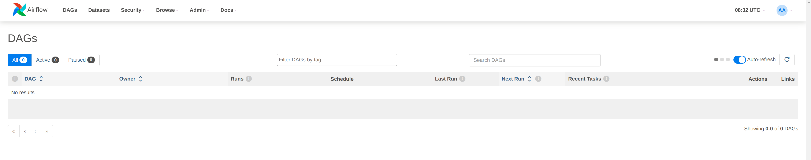

## 您的第一个 Apache Airflow 和 Qi Hop DAG

我们将使用 Apache Airflow 的 [DockerOperator](https://airflow.apache.org/docs/apache-airflow-providers-docker/stable/_api/airflow/providers/docker/operators/docker/index) 从 Apache Airflow 中的嵌入容器运行 Qi Hop workflow 和 pipeline。

同样，您不需要是 Apache Airflow、Docker 或 Python 专家就能创建 DAG，我们将 DAG 视为另一个文本文件。
由于我们将使用容器来运行我们的 workflow 和 pipeline，DAG 中的配置看起来与您传递给[短期 Qi Hop 容器](https://hop.apache.org/tech-manual/latest/docker-container)的环境变量非常相似。

让我们仔细看看我们将要使用的 DAG 中的一些内容。如果您之前在容器中运行过 Qi Hop workflow 和 pipeline，这会看起来非常熟悉：

将 DockerOperator 导入您的 DAG：

```
from airflow.operators.docker_operator import DockerOperator
```
让我们先看看 Qi Hop 任务的结尾部分：

```
mounts=[Mount(source='LOCAL_PATH_TO_PROJECT_FOLDER', target='/project', type='bind'),
        Mount(source='LOCAL_PATH_TO_ENV_FOLDER', target='/project-config', type='bind')],
```
mounts 部分是我们将您的项目和环境文件夹链接到容器的地方。
**LOCAL_PATH_TO_PROJECT_FOLDER** 是本地文件系统上项目文件夹的路径（您保存 hop-config.json 文件、metadata 文件夹以及 workflow 和 pipeline 的文件夹）。此文件夹将在容器内挂载为 /project。
**LOCAL_PATH_TO_ENV_FOLDER** 类似，但指向您的环境配置（json）文件所在的文件夹。此文件夹将在容器内挂载为 /project-config。

在 DAG 任务中定义和配置 pipeline：

```
hop = DockerOperator(
        task_id='sample-pipeline',
        # 使用 Qi Hop Docker 镜像。在默认的 apache/hop: 语法中添加您的标签
        image='apache/hop',
        api_version='auto',
        auto_remove=True,
        environment= {
            'HOP_RUN_PARAMETERS': 'INPUT_DIR=',
            'HOP_LOG_LEVEL': 'Basic',
            'HOP_FILE_PATH': '${PROJECT_HOME}/transforms/null-if-basic.hpl',
            'HOP_PROJECT_DIRECTORY': '/project',
            'HOP_PROJECT_NAME': 'hop-airflow-sample',
            'HOP_ENVIRONMENT_NAME': 'env-hop-airflow-sample.json',
            'HOP_ENVIRONMENT_CONFIG_FILE_NAME_PATHS': '/project-config/env-hop-airflow-sample.json',
            'HOP_RUN_CONFIG': 'local'
        },
```
需要指定的参数有：

- **task_id**：此 DAG 中此 Airflow 任务的唯一 ID
- **image**：在本示例中我们使用 "apache/hop"，它将始终获取最新版本。添加标签以使用特定的 Qi Hop 版本，例如 "apache/hop:2.4.0" 或 "apache/hop:Development" 以获取最新的开发版本
- **environment** 是我们告诉 DockerOperator 运行哪个 pipeline 并提供附加配置的地方。这里使用的环境变量与您在没有 Airflow 的情况下传递给独立的短期容器的完全相同：
** HOP_RUN_PARAMETERS：传递给 workflow 或 pipeline 的参数
** HOP_LOG_LEVEL：与您的 workflow 或 pipeline 一起使用的日志级别
** HOP_FILE_PATH：您要使用的 workflow 或 pipeline 的路径。这是容器内的路径，相对于项目文件夹
** HOP_PROJECT_DIRECTORY：您的项目文件所在的文件夹。在本示例中，这是我们在前一部分挂载的 /project 文件夹。
** HOP_PROJECT_NAME：您的 Qi Hop 项目名称。这仅在内部使用（并会显示在日志中）。您的项目名称不一定与您在 Hop GUI 中开发项目时使用的名称相同，但保持一致永远不会有坏处。
** HOP_ENVIRONMENT_NAME：与项目名称类似，这是容器启动时通过 hop-conf 创建的环境的名称。
** HOP_ENVIRONMENT_CONFIG_FILE_NAME_PATHS：环境配置文件的路径。这些文件路径应相对于我们在前一部分挂载的 /project-config 文件夹。
** HOP_RUN_CONFIG：要使用的 workflow 或 pipeline 运行配置。您的情况可能有所不同，但在绝大多数情况下，使用本地运行配置就是您需要的。

这就是我们首次运行所需指定的一切。这个 DAG 看起来像下面的样子：

```
from datetime import datetime, timedelta
from airflow import DAG
from airflow.operators.bash_operator import BashOperator
from airflow.operators.docker_operator import DockerOperator
from airflow.operators.python_operator import BranchPythonOperator
from airflow.operators.dummy_operator import DummyOperator
from docker.types import Mount
default_args = {
'owner'                 : 'airflow',
'description'           : 'sample-pipeline',
'depend_on_past'        : False,
'start_date'            : datetime(2022, 1, 1),
'email_on_failure'      : False,
'email_on_retry'        : False,
'retries'               : 1,
'retry_delay'           : timedelta(minutes=5)
}

with DAG('sample-pipeline', default_args=default_args, schedule_interval=None, catchup=False, is_paused_upon_creation=False) as dag:
    start_dag = DummyOperator(
        task_id='start_dag'
        )
    end_dag = DummyOperator(
        task_id='end_dag'
        )
    hop = DockerOperator(
        task_id='sample-pipeline',
        # 使用 Qi Hop Docker 镜像。在默认的 apache/hop: 语法中添加您的标签
        image='apache/hop',
        api_version='auto',
        auto_remove=True,
        environment= {
            'HOP_RUN_PARAMETERS': 'INPUT_DIR=',
            'HOP_LOG_LEVEL': 'Basic',
            'HOP_FILE_PATH': '${PROJECT_HOME}/transforms/null-if-basic.hpl',
            'HOP_PROJECT_DIRECTORY': '/project',
            'HOP_PROJECT_NAME': 'hop-airflow-sample',
            'HOP_ENVIRONMENT_NAME': 'env-hop-airflow-sample.json',
            'HOP_ENVIRONMENT_CONFIG_FILE_NAME_PATHS': '/project-config/env-hop-airflow-sample.json',
            'HOP_RUN_CONFIG': 'local'
        },
        docker_url="unix://var/run/docker.sock",
        network_mode="bridge",
        mounts=[Mount(source='LOCAL_PATH_TO_PROJECT_FOLDER', target='/project', type='bind'), Mount(source='LOCAL_PATH_TO_ENV_FOLDER', target='/project-config', type='bind')],
        force_pull=False
        )
    start_dag >> hop >> end_dag
```
## 部署和运行您的第一个 DAG

部署您的 DAG 只需将其放入 Airflow 的 dags 文件夹中。我们的 docker-compose 设置在您启动 compose 文件的目录中创建了一个 dags 文件夹。Airflow 默认每两分钟扫描一次此文件夹。

将我们刚创建的 DAG 保存为 apache-hop-dag-simple.py 到您的 dags 文件夹中。稍等片刻，您的 DAG 就会出现在 dag 列表中。

如果您的 DAG 中有语法错误，Airflow 会通知您。展开错误对话框以查看有关错误的更多详细信息，如下图所示。不用担心，我们刚创建的 DAG 不应该有任何错误。

> **📝 注意:** 如果您使用 `DockerOperator` 并且需要访问主机上运行的数据库或服务，请确保在 Hop 连接配置中将主机设置为 `host.docker.internal`，以允许容器访问主机服务。

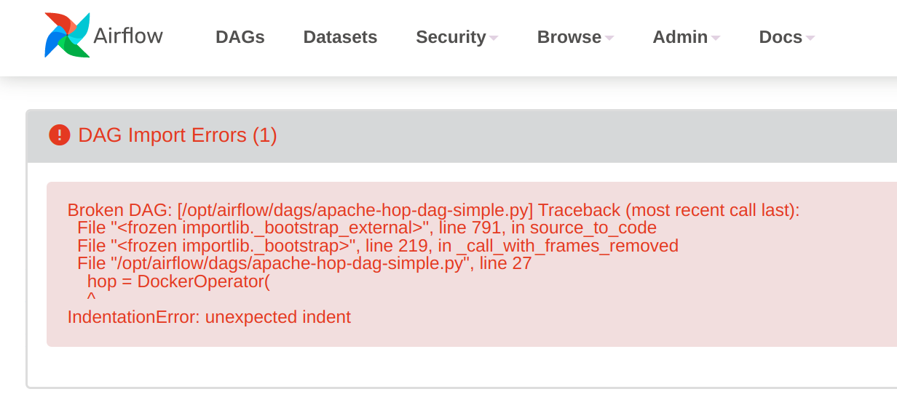

如果您的 DAG 部署正确（应该如此），您会看到它出现在可用 DAG 列表中。

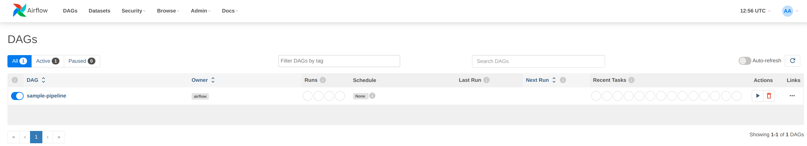

点击 **sample-pipeline** DAG 查看更多详细信息。从页面顶部的标签列表中选择 "Code" 来查看您刚部署的 DAG，或选择 "Graph" 查看 DAG 的图形表示。这个图极其简单，但我们正在探索 Apache Airflow，所以这是有意为之。

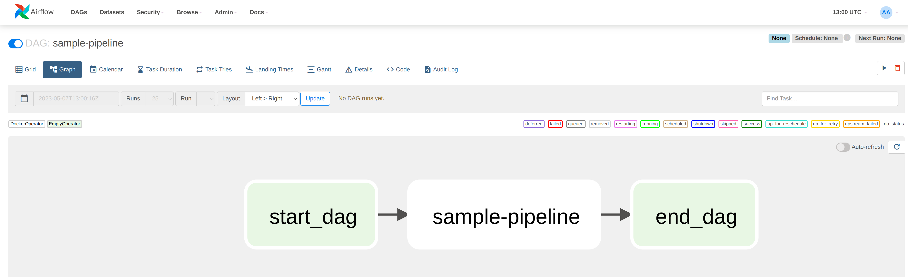

要运行此 DAG，请点击带有 **Trigger DAG** 选项的播放图标。该图标在 Apache Airflow 用户界面中的多个位置都可用。它几乎总是在右上角可用。

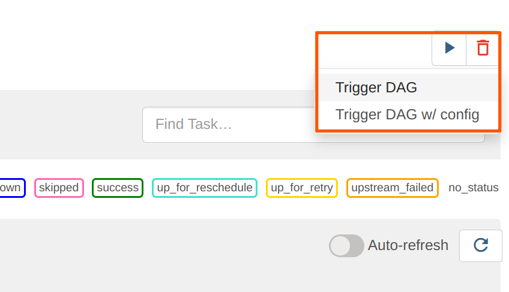

您的 DAG 将在后台运行。要跟进和检查日志，请点击您的 DAG 名称进入其详细信息页面。

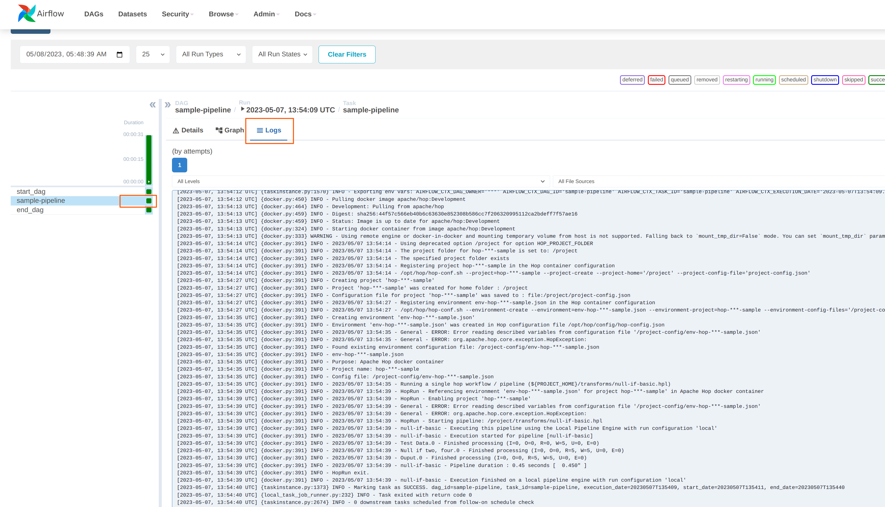

```
2024-05-07, 13:54:39 UTC] {docker.py:391} INFO - 2023/05/07 13:54:39 - Ouput.0 - Finished processing (I=0, O=0, R=5, W=5, U=0, E=0)

[2024-05-07, 13:54:39 UTC] {docker.py:391} INFO - HopRun exit.
[2024-05-07, 13:54:39 UTC] {docker.py:391} INFO - 2023/05/07 13:54:39 - null-if-basic - Execution finished on a local pipeline engine with run configuration 'local'
[2024-05-07, 13:54:40 UTC] {taskinstance.py:1373} INFO - Marking task as SUCCESS. dag_id=sample-pipeline, task_id=sample-pipeline, execution_date=20230507T135409, start_date=20230507T135411, end_date=20230507T135440
[2024-05-07, 13:54:40 UTC] {local_task_job_runner.py:232} INFO - Task exited with return code 0
```
当您返回 Airflow 主屏幕时，您的 DAG 现在将显示绿色圆圈表示成功运行。

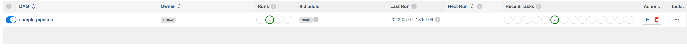

## 在 DAG 中使用变量和参数

您实际项目中的 pipeline 会比我们刚运行的极其简单的示例 pipeline 更复杂。

在我们刚运行的基础示例中，我们传递了环境文件但没有使用它。在很多情况下，您不仅想使用环境文件中的变量，还想将参数传递给您的 pipeline 和 workflow。让我们仔细看看。

将下面的环境配置创建到项目文件夹旁边的 config 文件夹中。我们将使用示例项目中的 `pipelines/pipeline-with-parameter.hpl` pipeline 将 pipeline 参数和环境配置文件中的变量打印到日志中。同样，这些示例极其简单，您的实际项目会更复杂，但流程保持不变。

```
{
  "variables" : [ {
    "name" : "ENV_VARIABLE",
    "value" : "variable value",
    "description" : ""
  } ]
}
```
这个 pipeline 同样非常基础。我们要做的就是接受一个参数并将其打印到日志中：

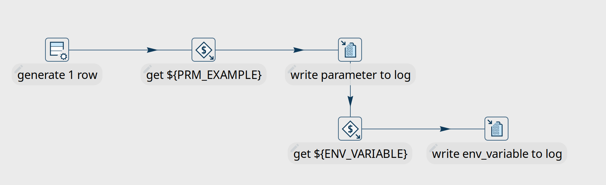

我们将为此示例创建一个新的 DAG。大部分内容与之前的示例相同或类似，只有一些小的变化：

首先，我们需要在 DAG 开头添加一个额外的导入：

```
from airflow import DAG
from airflow.models import Variable
from airflow.operators.bash_operator import BashOperator
```
接下来，我们需要在此 pipeline 中添加参数，并告诉 Airflow 从我们稍后传递给 DAG 的运行配置中获取值。

我们还将使用 Detailed 日志级别，以确保能看到我们传递给 pipeline 的参数。

```
environment= {
            'HOP_RUN_PARAMETERS': 'PRM_EXAMPLE=',
            'HOP_LOG_LEVEL': 'Detailed',
            'HOP_FILE_PATH': '${PROJECT_HOME}/hop/pipeline-with-parameter.hpl',
            'HOP_PROJECT_DIRECTORY': '/project',
            'HOP_PROJECT_NAME': 'hop-airflow-sample',
            'HOP_ENVIRONMENT_NAME': 'env-hop-airflow-sample.json',
            'HOP_ENVIRONMENT_CONFIG_FILE_NAME_PATHS': '/project-config/hop-airflow-config.json',
            'HOP_RUN_CONFIG': 'local'
        },
```
此外，这次我们确实需要环境配置文件，所以请确保您的挂载正确。

```
mounts=[Mount(source='<YOUR_PROJECT_PATH>/', target='/project', type='bind'),
                Mount(source='<YOUR_CONFIG_PATH>/config/', target='/project-config', type='bind')],
```
将此新 DAG 添加到您的 dags 文件夹中，等待它出现在 Apache Airflow 控制台中。

要带参数运行此 DAG，我们将使用 **Trigger DAG w/ config** 选项。我们将指定 Airflow 将传递给 pipeline 中 **PRM_EXAMPLE** 参数的 **prm_example** 值。要使用的语法如下所示。完成后点击 "Trigger"。

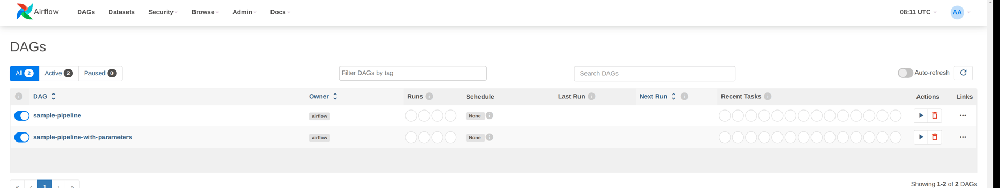

| 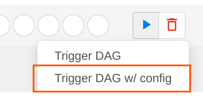 |
|---|
| 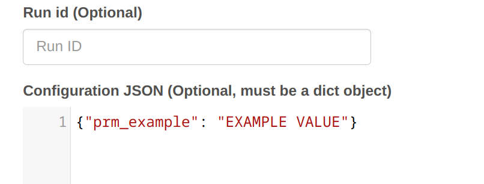 |
| 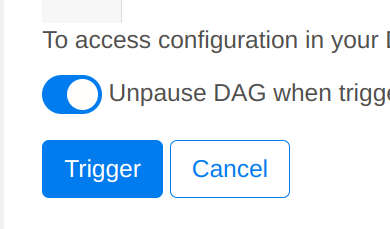 |

您的 DAG 日志现在将显示我们在本示例中使用的环境变量和参数：

```
[2024-05-08, 08:21:34 UTC] {docker.py:391} INFO - 2023/05/08 08:21:34 - pipeline-with-parameter - Pipeline has allocated 5 threads and 4 rowsets.
[2024-05-08, 08:21:34 UTC] {docker.py:391} INFO - 2023/05/08 08:21:34 - generate 1 row.0 - Starting to run...
[2024-05-08, 08:21:34 UTC] {docker.py:391} INFO - 2023/05/08 08:21:34 - generate 1 row.0 - Finished processing (I=0, O=0, R=0, W=1, U=0, E=0)

[2024-05-08, 08:21:34 UTC] {docker.py:391} INFO - 2023/05/08 08:21:34 - get ${PRM_EXAMPLE}.0 - Finished processing (I=0, O=0, R=1, W=1, U=0, E=0)
[2024-05-08, 08:21:34 UTC] {docker.py:391} INFO - 2023/05/08 08:21:34 - write parameter to log.0 -

[2024-05-08, 08:21:34 UTC] {docker.py:391} INFO - 2023/05/08 08:21:34 - write env_variable to log.0 -
[2024-05-08, 08:21:34 UTC] {docker.py:391} INFO - 2023/05/08 08:21:34 - write parameter to log.0 - Finished processing (I=0, O=0, R=1, W=1, U=0, E=0)
[2024-05-08, 08:21:34 UTC] {docker.py:391} INFO - 2023/05/08 08:21:34 - get ${ENV_VARIABLE}.0 - Finished processing (I=0, O=0, R=1, W=1, U=0, E=0)
[2024-05-08, 08:21:34 UTC] {docker.py:391} INFO - 2023/05/08 08:21:34 - write env_variable to log.0 - Finished processing (I=0, O=0, R=1, W=1, U=0, E=0)
```
## 在 Apache Airflow 中调度 DAG

到目前为止，我们查看的都是手动和临时运行的 DAG。Apache Airflow 中有许多[有充分文档记录的](https://airflow.apache.org/docs/apache-airflow/stable/authoring-and-scheduling/index)选项来调度 DAG。由于调度您的 DAG 并不真正与 Qi Hop 相关，我们在此仅简要介绍。

一种选择是提供 cron 字符串来调度您的 DAG 执行。例如，要每天早上 10:00 运行特定 DAG，我们将 DAG 中 "with DAG" 行的 schedule_interval 从 None 更改为 cron 表达式（为可读性添加了换行）：

```
  with DAG(
      'sample-pipeline',
      default_args=default_args,
      schedule_interval='0 10 * * *',
      catchup=False,
      is_paused_upon_creation=False
    ) as dag:
```
有关 Apache Airflow 中调度选项的更详细描述，您可能会发现[这篇 Medium 文章](https://medium.com/@thehippieandtheboss/how-to-define-the-dag-schedule-interval-parameter-cb2d81d2a02e)很有帮助。

## 总结

我们介绍了使用 DockerOperator 在 Apache Airflow 中运行 Qi Hop pipeline（或 workflow）的基础知识。

还有其他选项：您可以使用 Airflow 的 [BashOperator](https://airflow.apache.org/docs/apache-airflow/stable/howto/operator/bash) 直接使用 [hop-run](../index.md)，或使用 [HTTP operator](https://airflow.apache.org/docs/apache-airflow-providers-http/stable/operators) 在远程 hop server 上运行 pipeline 或 workflow。
