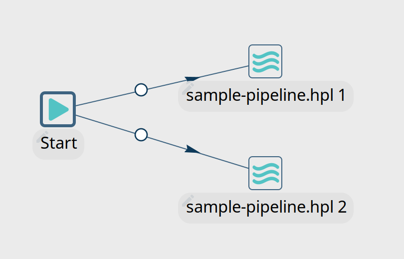
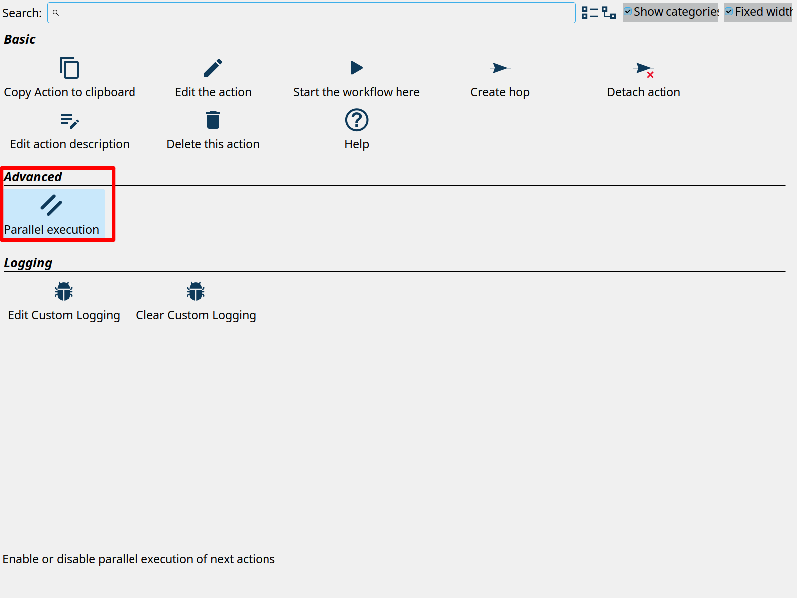
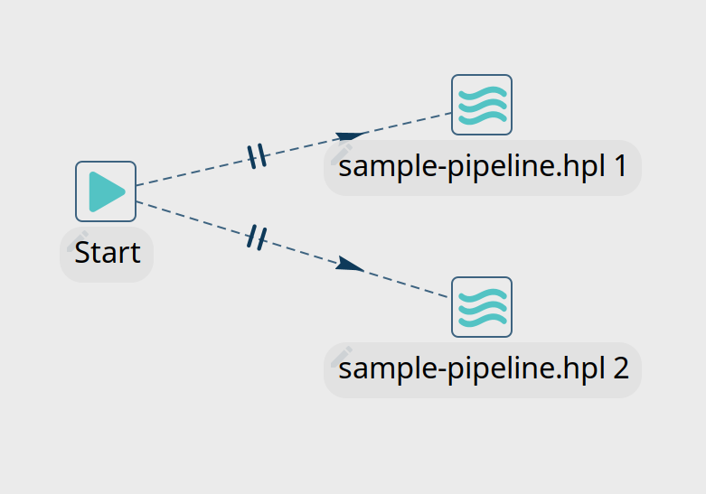
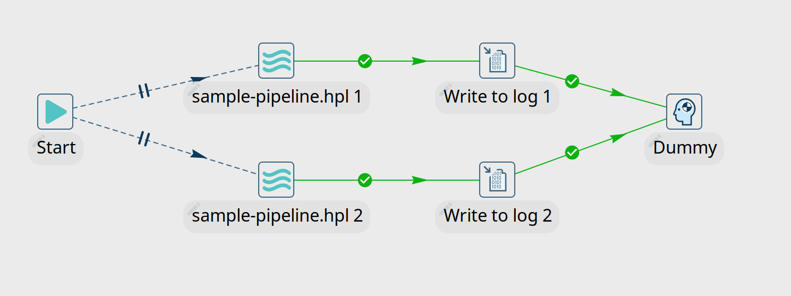
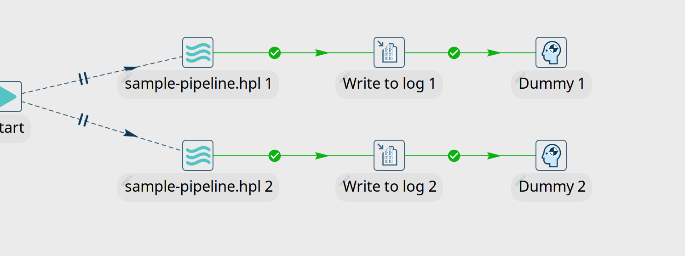
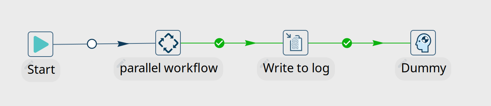
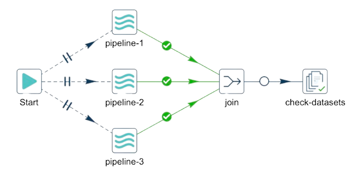

# Qi Hop workflow 中的并行执行

新 Qi Hop 用户最先学到的[概念](../01-快速入门/installation-configuration.md)之一是 pipeline 以并行方式执行，而 workflow 以顺序方式执行。

然而，在某些情况下，您会想要覆盖这些默认设置，顺序执行 pipeline 并行执行 workflow。我们将更详细地了解后一个用例，并展示如何在 workflow 中并行运行 action。

## 多个 workflow action hop

如您所知，workflow 中的 action 是顺序执行的。workflow 中的每个 action 都有一个退出码（成功或失败），用于确定 workflow 将遵循的路径。在无条件 hop 的情况下可以忽略此退出码。

一个 workflow action 可以有多个输出 hop。然而，这并不意味着 workflow 会并行执行所有 hop。如果一个 action 有多个输出 hop，默认的 workflow 行为是按照它们被添加到 workflow 中的顺序依次执行所有 action。

在下面的示例中，workflow 将首先执行 "sample-pipeline.hpl 1"。该 action 完成后，workflow 将继续执行 "sample-pipeline.hpl 2"。



## 并行执行

workflow 中的并行执行是可能的，但需要显式指定。为此，请点击 action 的图标，然后点击 "parallel execution" 选项。启用并行选项后，hop 线将变为点状和双交叉线，如下面的截图所示。

请记住，并行执行意味着所有并行运行的 action 都需要共享 Java 虚拟机 (JVM) 中的资源。并行运行的小型 pipeline 和 workflow action 可能会更快，但需要大量内存或 CPU 的大型项目在顺序执行时可能更快。





当您运行此 workflow 时，日志消息会告诉您两个 action 已并行启动：

```shell
2023/05/01 10:14:42 - parallel-workflow - Start of workflow execution
2023/05/01 10:14:42 - parallel-workflow - Starting action [sample-pipeline.hpl 1]
2023/05/01 10:14:42 - parallel-workflow - Launched action [sample-pipeline.hpl 1] in parallel.
2023/05/01 10:14:42 - parallel-workflow - Starting action [sample-pipeline.hpl 2]
2023/05/01 10:14:42 - parallel-workflow - Launched action [sample-pipeline.hpl 2] in parallel.
```

## 组合顺序和并行执行

一旦您告诉 workflow 从给定 action 开始并行运行，它将继续并行运行后续 action。

考虑下面这个极其简单的 workflow。此 workflow 并行启动两个 "sample pipeline" action。在示例 pipeline 之后，workflow 将执行各自的 "Write to log" action，两个 workflow 都将执行 "Dummy" action。

实际结果将如下面第二张截图所示：





在很多情况下，您只想并行执行 workflow 的部分内容。示例用例可能是在继续更繁重的工作之前，将数据加载到多个相对较小的数据库表或生成多个相对较小的文件。

在这些场景中，您会希望将并行处理隔离在单独的子 workflow 中。

在下面的截图中，我们将要并行执行的部分 workflow 隔离到一个子 workflow 中。当此 workflow 运行时，子 workflow（"parallel workflow"）将并行运行两个 action。子 workflow 将并行运行两个示例 pipeline。当这两个 pipeline 中的最后一个完成时，父 workflow 将继续其（顺序）执行。




### 使用 Join Action 替代子 Workflow

从 Qi Hop 的近期版本开始，您可以使用新的 `Join` action *无需子 workflow* 即可实现相同的效果。

`Join` action 允许您*在同一 workflow 中直接同步多个并行分支*。它会等待所有传入分支完成，然后才允许 workflow 继续。这使得当您想在单个 workflow 中组合并行和顺序执行时非常理想，而无需嵌套子 workflow 的额外复杂性。

要使用 Join action：

. 从您的起始 action 创建多个输出 hop。
. 在您想同时运行的 hop 上启用*并行执行*。
. 在这些分支应合并的地方添加一个 `Join` action。
. 将 `Join` action 连接到下一个顺序 action。



这种方法简化了 workflow 设计，提高了可读性，并减少了需要管理的组件数量。

*以下情况使用 `Join` action：*

- 您想在单个 workflow 中同步并行执行。
- 您想避免为基本并行分支使用外部子 workflow。
- 您需要*仅在每个并行分支完成后*继续处理。

## 总结

在本文中，我们介绍了在 Qi Hop 中并行运行 workflow action 的各种选项。您还学习了如何通过子 workflow 组合并行和顺序执行。
