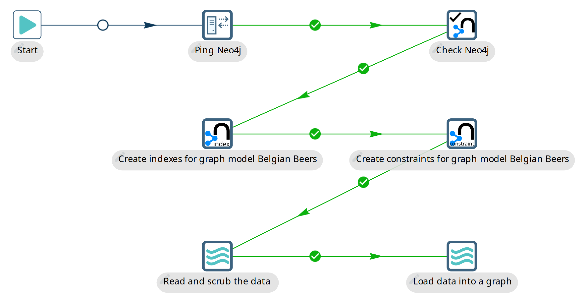
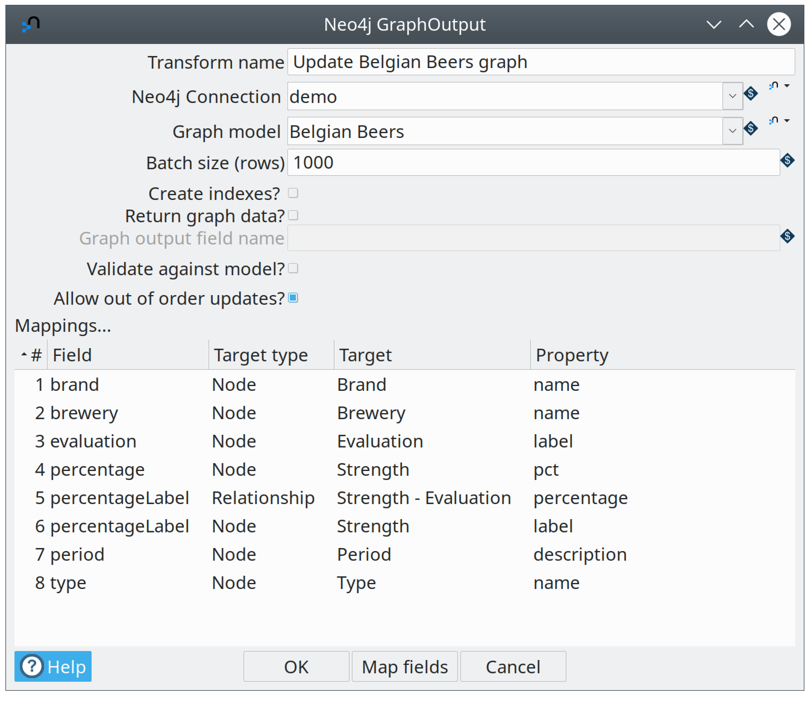
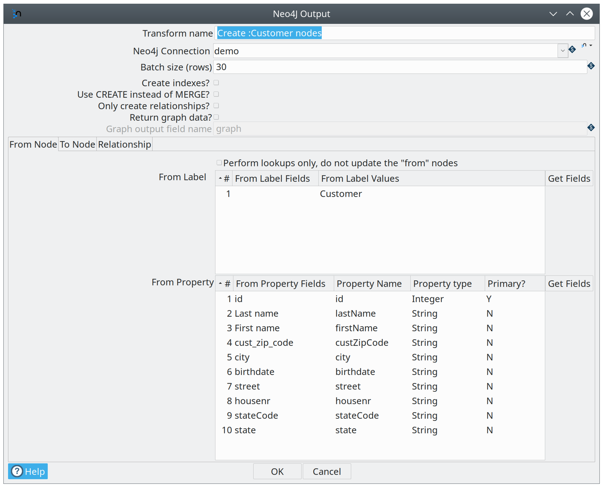
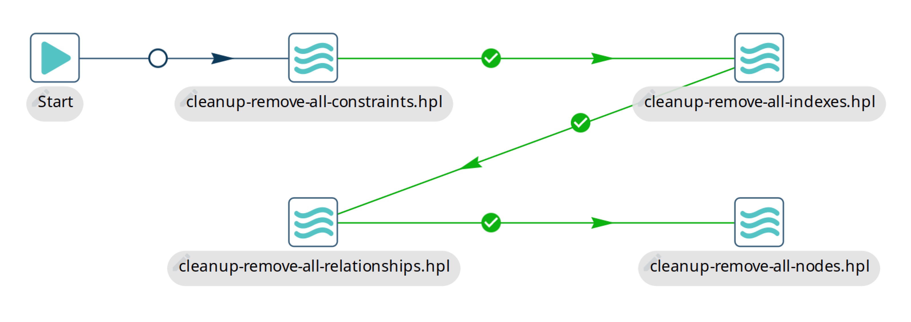

# 使用 Neo4j 数据

本文通过示例解释如何开始将数据加载到 Neo4j 中，以及如何在需要时将数据取回。

## 简介

图由节点和关系（也称为边）组成。
关系连接节点，两者都可以有任意数量的属性。
在这方面，图与您典型的"关系型数据库"不同，这暗示了将数据加载到 Neo4j 和取回时的典型挑战：关系型数据和图数据之间的转换。
在本文中，我们将概述一些入门的可能性。

## 示例设置

要使 `samples` 项目中 `neo4j/` 文件夹下的 Neo4j 示例正常工作，您需要配置几个变量：

- *NEO4J_HOSTNAME*：Neo4j 服务器主机名
- *NEO4J_PORT*：Neo4j 数据库端口（默认为 7687）
- *NEO4J_USERNAME*：用户名
- *NEO4J_PASSWORD*：密码

这些变量可以通过创建一个代表您环境的新环境来轻松设置。
创建一个新的环境配置文件并在其中设置这些变量。

## 更新图

### Graph Output：啤酒 Wikipedia 示例

[Graph Output](../03-转换插件/其他转换/neo4j-graphoutput.md) transform 是一个有用的 transform，能够同时更新多个节点和关系。
要开始使用此 transform，您可以查看 workflow `neo4j/beers-wikipedia-graph.hwf`。



此 workflow 执行以下 action：

- *Ping Neo4j*：对 Neo4j 服务器执行网络 ping 以查看其是否可达。
- *Check Neo4j*：连接到 Neo4j 服务器并从中返回一个静态值，以查看其是否按预期工作
- *为图模型 Belgian Beers 创建索引*：创建索引以在更新节点或关系时获得出色的性能
- *为图模型 Belgian Beers 创建约束*：创建约束以保证主键属性的唯一性
- *读取和清理数据*：从 Wikipedia 加载包含比利时啤酒信息的表格的原始 HTML。
这些信息经过清理（清洗）并翻译为英文。
- *将数据加载到图中*：使用 `Belgian Beers` 图模型和字段到图的映射将数据加载到 Neo4j。

数据映射到图模型的方式非常简单。
以数据加载 pipeline 中的 Graph Output transform 为例：



如上所示，此 transform 不需要任何技术知识。
您可以使用"Map fields"按钮，通过 GUI 将左侧的输入字段映射到图模型中的各种节点和关系属性。
您也可以手动执行此操作。

### Neo4j Output：并行数据加载

[Neo4j Output](../03-转换插件/Neo4j图数据库类/neo4j-output.md) transform 适用于向一个节点、两个节点和/或一个关系进行简单的数据加载。
使用它不需要任何 Cypher 知识。
请查看 workflow `neo4j/neo4j-output-parallel-load.hpl`：


在这个特定示例中，我们只是将字段映射到单个节点的属性，因此我们可以使用 Neo4j Output transform 而不是上面描述的 Graph Output。
优势在于我们有一个更简单的映射，并且可能更快地加载数据。



此 transform 也不需要图模型，因此非常适合快速处理简单场景而无需任何麻烦。
此示例还展示了您可以并行加载更大的数据集。
实际上，此 pipeline 有一个名为 `COPIES` 的参数，默认设置为 4，将以 4 个不同的线程并行加载到 Neo4j。

### Cypher：一个简单的 unwind 示例

[Neo4j Cypher](../03-转换插件/其他转换/neo4j-cypher.md) transform 是我们 Neo4j 工具箱中的瑞士军刀。
如果您有 Cypher 知识，它几乎可以做所有与 Neo4j 相关的事情。
在示例 `neo4j/neo4j-cypher-unwind-simple.hpl` 中：


在这个特定示例中，我们始终使用相同的 Cypher 语句。
这允许我们对输入数据进行分组，以便我们可以使用 [UNWIND](https://neo4j.com/docs/cypher-manual/current/clauses/unwind/) 命令，这将显著提高性能。
这是对将不同命令批量处理在一起的改进。

我们需要做的第一件事是将所有输入行（映射到参数值）收集到一个值映射中（在 Options 标签页上）：


您希望传递给 Cypher 语句的参数列在 Parameters 标签页上。
最后，我们可以构造 Cypher 语句本身：

```
UNWIND $events AS event
MERGE (y:Year { year: event.year })
MERGE (y)<-[:IN]-(e:Event { id: event.id })
RETURN e.id AS x
ORDER BY x
```
### 删除数据：清理示例

有时您可能想从 Neo4j 中删除一组数据甚至所有数据，例如在测试期间（参见 Hop 项目的 Neo4j 集成测试获取示例）。
包含的示例名为 `neo4j/cleanup-remove-everything.hwf`



删除索引和约束的方式是通过调用 `db.indexes()` 或 `db.constraints()` 并遍历这些值来删除所有索引和约束。
节点和关系分批删除，以减轻 Neo4j 数据库事务处理器的压力。
由于 Neo4j 是一个 ACID 合规的数据库，该处理器在删除大量节点或关系时可能会遇到困难。

## 检索数据

### Cypher：复杂返回

如上所述，[Neo4j Cypher](../03-转换插件/其他转换/neo4j-cypher.md) transform 不仅可以用于加载数据，还可以用于检索数据。
示例 pipeline `neo4j/neo4j-cypher-complex-returns.hpl` 展示了如何从 Neo4j 图中返回 List、Map 和 Node 等复杂数据类型：


实现方式是 Node、Relationship 和 Path 值可以映射到 Hop Graph 或 String（JSON 格式）输出字段。
Neo4j 的 List 和 Map 数据类型始终转换为 JSON 格式的 String 字段。
这些可以在 pipeline 的其余部分中进一步处理。

## 批量加载

有时我们想在开始更新图之前加载多年的历史数据。
在这种情况下，我们可以使用 [neo4j-admin import](https://neo4j.com/docs/operations-manual/current/tools/neo4j-admin-import/) 工具。
此工具专为快速批量加载大量数据到新图数据库而设计。
它通过加载预期为特定格式的 CSV 文件来描述图中的各种节点和关系。

为了帮助导入，我们提供了多种工具供您使用：

- Graph 数据类型：[Neo4j Output](../03-转换插件/Neo4j图数据库类/neo4j-output.md) 和 [Neo4j Graph Output](../03-转换插件/其他转换/neo4j-graphoutput.md) transform 可以选择将其输出写入 `Graph` 类型的字段。
这些 transform 能够标记节点的主键字段，这包含了足够的信息来生成 CSV 文件...
- [Neo4j Split Graph](../03-转换插件/其他转换/neo4j-split-graph.md)：使用此 transform，我们可以拆分 Graph Output transform 生成的存储在单个 Graph 字段中的多个节点和关系。
然后您可以过滤掉特定的节点或关系以保证唯一性或其他后处理。
- [Neo4j 生成 CSV](../03-转换插件/其他转换/neo4j-gencsv.md)：此 transform 将帮助您创建用于导入的 CSV 文件。
- [Neo4j Import](../03-转换插件/其他转换/neo4j-import.md)：此 transform 将为您生成并执行 `neo4j-admin import` 语句。
它使用 CSV 文件列表及其类型（节点/关系）以及您在 transform 对话框中选择的选项来完成此操作。
